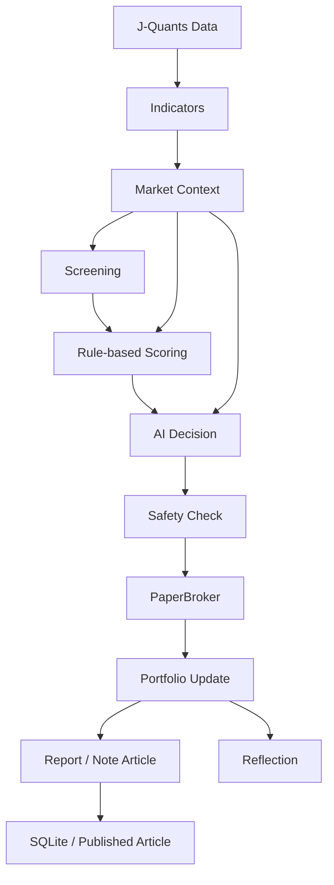

# AI Fund Lab / AIファンド研究所

AI Fund Lab は、日本株の短期売買を行うAIファンドマネージャーを研究・育成するプロジェクトです。

単なる自動売買システムではありません。

- AIの判断を記録する
- AIの成長を観察する
- AI同士を比較する
- 運用記録をコンテンツ化する

ことを目的としています。

最初のAIファンドマネージャーは「新人ディーラー1号」です。証券会社の研修を終えたばかりの、教科書通りでお堅い新人ディーラーという設定です。

現在はPaperBrokerによる仮想売買が中心です。ダミーデータでのデモに加えて、J-Quants実データ連携の準備と一部実装があります。実売買は未実装で、証券会社APIへの実発注は行いません。

## 実装ステータス

README内では、実装済み、部分実装、準備中、将来予定を以下の意味で使います。

- 実装済み: ローカルで動作確認でき、通常フローから利用する機能
- 部分実装: コードとCLIはあるが、外部API、データ条件、運用検証に制約がある機能
- 準備中: 設計、設定、スタブ、ドキュメントはあるが、実運用機能としては未完成の機能
- 未実装: 現時点では動作する実装がなく、呼び出してもスタブまたは例外で止める機能
- 将来予定: 今後の構想であり、現時点では未実装の機能

| 対象 | ステータス | 現状 |
| --- | --- | --- |
| J-Quants取得 | 部分実装 | `healthcheck`、銘柄一覧、価格取得、指標計算、run-daily/backtest連携のコードあり。外部APIキー、ネットワーク、Freeプラン遅延データ前提で検証が必要 |
| PaperBroker | 実装済み | 仮想売買のみ実行。実注文は送信しない |
| SQLite | 実装済み | portfolio、trades、screening、scoring、AI Decision、market_context、AI改善用export履歴を保存 |
| profile切替 | 実装済み | `--profile` で `config/profiles/*.yaml` を切替。`profile_id` / `profile_name` / `config_version` を保存 |
| OpenAI任意化 | 実装済み | `OPENAI_API_KEY` 未設定でも動作。rule_basedへフォールバック |
| AI Decision | 部分実装 | 任意機能。OpenAI有効時は候補をまとめて最終判断。未設定・失敗時はrule_basedへフォールバック |
| market_context | 部分実装 | 東証プライム全体の地合いを計算・保存。欠損時は中立扱い |
| sector_momentum | 部分実装 | 業種別モメンタムを計算し、候補銘柄とスコア補正に利用。データ欠損時は中立扱い |
| candlestick analysis | 実装済み | ローソク足特徴量と短期シグナルを計算し、scoringや記事表示に利用 |
| pandas-ta | 部分実装 | Python 3.12以上で利用。MA、RSI、MACD、ボリンジャーバンド、ATR計算に使用 |
| Tachibana API | 部分実装 | Read Only Brokerで口座残高、保有銘柄、注文、約定の参照IFを実装。実API発注は未実装 |
| 実売買 | 未実装 / 将来予定 | 未実装。安全ロックとスタブにより現時点では実注文しない |

## 運用方法

Mac上で定期実行するための詳細手順は [docs/operations.md](docs/operations.md) にまとめています。ここでは最短の入口だけを示します。

初回セットアップでは、`.env` を作成してJ-QuantsなどのAPIキーを設定し、秘密情報をGit管理しないことを確認します。続いて仮想環境を作成し、依存関係を入れ、DBを初期化します。

```bash
python3 -m venv .venv
.venv/bin/python -m pip install -r requirements.txt
.venv/bin/python src/main.py --mode init-db --profile rookie_dealer_02_v2_1
.venv/bin/python src/main.py --mode healthcheck --provider jquants --profile rookie_dealer_02_v2_1
```

日次のPaperBroker運用では、実売買は行わず、preflight、PaperBroker実行、分析、レポート確認の順に進めます。

```bash
scripts/run_daily_paper.sh
scripts/run_analyze.sh
```

主な確認先は `logs/cron.log`、`logs/paper_run.log`、`reports/<profile_id>/backtests/`、`reports/<profile_id>/backtests/analysis_latest.md` です。異常時は `storage/STOP_TRADING` を作成して新規買付を停止し、ログとレポートを確認します。

cron / launchd での定期実行は `scripts/run_evening_selection.sh` と `scripts/run_demo_auto_order.sh` を呼び出す形にします。Macではcronよりlaunchdを推奨します。plist例は [docs/launchd/com.negima.ai-fund-lab.paper-run.plist](docs/launchd/com.negima.ai-fund-lab.paper-run.plist) にあります。`tachibana_live` の自動実行例は用意しません。

運用スケジュールは [config/operation_schedule.yaml](config/operation_schedule.yaml) に定義します。16:00以降に当日終値ベースで銘柄選定し、16:30にpaper runとレポート作成、翌営業日08:30に注文候補確認、08:35に `tachibana_demo` の自動発注検証、09:00〜09:30に人間が発注結果と実売買判断を確認する前提です。`auto_order_enabled: true` は `tachibana_demo` だけに限定し、`forbid_live_auto_order: true` を維持します。live自動売買は禁止です。

demo自動売買の流れは、夕方に `scripts/run_evening_selection.sh` で注文候補を作り、翌朝に `scripts/run_demo_auto_order.sh` で `tachibana_demo` へ自動発注します。live環境では `env=live`、`broker=tachibana_live`、cash不足、同一銘柄保有中、`max_positions` 超過、当日注文上限超過などを検知して停止します。

本番移行前チェックリスト:

- `tachibana_demo` で注文候補、発注結果、約定取得が一通り検証済み
- `forbid_live_auto_order: true` を維持
- live自動売買を有効化しない
- 手動承認フローと停止手順を人間が確認済み
- `.env` と秘密情報がGit管理されていない

よく使うコマンドは以下です。

```bash
.venv/bin/python src/main.py --mode status --profile rookie_dealer_02_v2_1
.venv/bin/python src/main.py --mode healthcheck --provider jquants --profile rookie_dealer_02_v2_1
.venv/bin/python src/main.py --mode preflight --provider jquants --profile rookie_dealer_02_v2_1
.venv/bin/python src/main.py --mode full-paper-run --provider jquants --profile rookie_dealer_02_v2_1 --start-date YYYY-MM-DD --end-date YYYY-MM-DD
.venv/bin/python src/main.py --mode analyze --profile rookie_dealer_02_v2_1
.venv/bin/python src/main.py --mode compare-profiles --profiles rookie_dealer_02_v2_1 rookie_dealer_02_v2_4 --start-date YYYY-MM-DD --end-date YYYY-MM-DD
.venv/bin/python src/main.py --mode export-ai-summary --profile rookie_dealer_02_v2_1 --start-date YYYY-MM-DD --end-date YYYY-MM-DD
```

## なぜ作るのか

AI Fund Lab は、AIに売買を任せることそのものよりも、AIが何を見て、なぜ判断し、その結果から何を学ぶのかを記録するために作ります。

利益だけを追うと、判断の再現性や失敗からの学習が見えにくくなります。このプロジェクトでは、候補に入った理由、選ばれた理由、落選した理由、買った理由、売った理由、売却後の振り返りまでを保存します。

また、運用記録を日報やnote記事Markdownとして残し、後から読み返せるコンテンツにします。AIファンドの成績だけでなく、AIファンドマネージャーとしての成長過程も観察対象にします。

## プロジェクトのゴール

短期的なゴールは以下です。

- AIファンド1号を完成させる
- 売買判断ログを蓄積する
- 日報を自動生成する
- note記事を自動生成する

中長期的なゴールは以下です。

- 実売買へ移行
- AIファンド2号、3号を追加
- AI同士の成績比較
- オルカンをベンチマークとして運用成績を評価
- コンテンツ化による収益化

## 設計思想

AIは判断・採点・コメント生成を担当します。

Pythonはルール判定・売買執行・ログ保存を担当します。

AIは売買ルールを勝手に変更しません。改善案を出す場合も、実際のルール変更ではなく `suggestions` として保存します。

感情を排除し、再現可能な運用を目指します。

ログを最重要資産と考えます。

利益だけではなく、「なぜその判断をしたのか」を保存します。

選定銘柄だけでなく、落選銘柄もログに残します。これにより、後から「なぜ買ったのか」だけでなく「なぜ買わなかったのか」も検証できます。

## 新人ディーラー1号のプロフィール

名前: 新人ディーラー1号

設定: 証券会社の研修を終えたばかりの新人ディーラー。

特徴:

- 教科書通り
- データ重視
- 感情なし
- ルール厳守
- 損切りをためらわない
- 利確をためらわない

口癖:

- ルールに従います
- 感情は考慮しません
- 統計的優位性を優先します

## Profile設計

AI Fund Labのシステム本体、DB、データ取得処理、スコアリング処理は共通です。AIファンドごとの性格、売買ルール、リスク許容度、分析機能のON/OFFは `config/profiles/` 配下のprofile YAMLで切り替えます。

実行時は `--profile` で使用するprofileを指定します。未指定時は `rookie_dealer_01` を使います。

```bash
python src/main.py --mode run-daily --profile rookie_dealer_01 --provider jquants --date YYYY-MM-DD
python src/main.py --mode backtest --profile rookie_dealer_01 --provider jquants --start-date YYYY-MM-DD --end-date YYYY-MM-DD
python src/main.py --mode status --profile rookie_dealer_01
```

既存の `config/rookie_dealer.yaml` は互換性のため残します。今後の正は `config/profiles/rookie_dealer_01.yaml` などのprofileファイルです。2号、3号は新しいprofile YAMLを追加するだけで作れます。秘密情報はprofileに含めず、APIキーや口座情報はこれまで通り `.env` で別管理します。

DBと主要ログには `profile_id`、`profile_name`、`config_version` を保存します。出力先もprofileごとに分離します。

- `reports/rookie_dealer_01/`
- `articles/drafts/rookie_dealer_01/`
- `logs/scoring/rookie_dealer_01/`
- `logs/trades/rookie_dealer_01/`

`analyze` ではprofile別の総資産、勝率、最大ドローダウン、総取引数も集計します。結果は `profile_id` と `config_version` で追跡します。

## Profile Registry

検証profileの目的、推奨J-Quants plan、有効機能、比較対象は [config/profile_registry.yaml](config/profile_registry.yaml) で一覧管理します。登録済みprofileはCLIから確認できます。

```bash
python src/main.py --mode list-profiles
python src/main.py --mode profile-info --profile rookie_dealer_02_v2_6
python src/main.py --mode compare-experiments --base rookie_dealer_02_v2_1
python src/main.py --mode run-experiments --base-profile rookie_dealer_02_v2_1 --period 5y --fast-analysis
python src/main.py --mode run-experiments --base-profile rookie_dealer_02_v2_1 --profiles rookie_dealer_02_v2_6 rookie_dealer_02_v2_8 --period 1y --fast-analysis
python src/main.py --mode validate-config
python src/main.py --mode validate-config --profile rookie_dealer_02_v2_6 --strict
python src/main.py --mode simulate-operation --days 1 --profile rookie_dealer_02_v2_1
python src/main.py --mode simulate-operation --days 30 --profile rookie_dealer_02_v2_1
```

`list-profiles` は `profile_id`、`role`、`required_plan`、`enabled_features`、`compare_to`、`description` を表示します。`profile-info` は必要J-Quants plan、比較対象、profile YAML path、score formula、required capabilities、推奨backtest/compare commandを表示します。`compare-experiments` はregistry上で `compare_to` がbaseを指すexperiment profileをまとめ、`reports/profile_comparisons/experiment_summary.md` に比較対象一覧と推奨コマンドを書き出します。`--start-date` と `--end-date` を付けると、DBに結果がある範囲で成績サマリーも追記します。

`run-experiments` はregistry上のexperiment profileを同一期間・同一条件で一括検証します。`--base-profile` 未指定時はregistryの先頭baselineを使い、`--profiles` 未指定時はそのbaseを `compare_to` に持つexperiment profileを全て対象にします。`deprecated` profileは対象外です。base profileを含めて順番にbacktestし、各profileのanalyzeを実行し、compare-profiles相当の比較と `reports/experiments/YYYY-MM-DD_to_YYYY-MM-DD/<base_profile>/experiment_summary.md` / `.json` を生成します。`compare_profiles.md` / `.json` も同じディレクトリへコピーします。

`--period 6m|1y|3y|5y` を使うと期間を自動計算できます。CLIで `--start-date` / `--end-date` を指定した場合は明示日付を優先します。`--profiles rookie_dealer_02_v2_6 rookie_dealer_02_v2_8` を付けると対象実験を絞れます。`--skip-backtest` は既存DB結果を使ってanalyze/compareのみ実行し、`--skip-analyze` はanalyzeを省略してcompareのみ進めます。どちらも必要な既存結果がなければ分かりやすく停止します。実行するのはbacktest/analyze/compareのみで、実売買やbroker発注は行いません。

各profile実行前にregistryの `required_plan` と現在のJ-Quants planを照合します。Light専用capabilityがFree planで不足していてもfallback可能ならwarningとして実行し、fallback不可ならそのprofileを `skipped` としてsummaryに残します。J-Quants planは `config/jquants.yaml` を正とし、`--jquants-plan` は一時上書き用途だけにします。

実験判定は `candidate`、`needs_review`、`rejected`、`no_practical_effect` で表示します。baseより累計利益が増え、PFがbaseの95%以上、最大DDが大きく悪化せず、取引数がbaseの50%以上で、実際の採用/除外差分があれば `candidate` です。利益は増えたがDD/PF/取引数に懸念がある場合やサンプルが少ない場合は `needs_review`、利益・PF・DDが明確に悪化した場合は `rejected`、採用/除外差分がなく主要指標も一致する場合は `no_practical_effect` です。理由は `verdict_reason` に出力します。

`validate-config` は本格テスト前の設定確認です。対象は `config/jquants.yaml`、`config/operation_schedule.yaml`、`config/profile_registry.yaml`、`config/profiles/*.yaml` です。profile YAMLの存在、registryとの対応、registry内の `profile_id` 一致、role、`compare_to` と参照先、`required_plan`、featuresのbool定義、現在のJ-Quants planで必要capabilityが満たせるか、fallback可能か、score formulaと閾値の矛盾、旧固定加点の `news_score` / `financial_score` / `base_score` の残存、`use_relative_strength_score` などのscore設定とfeaturesの整合性、live auto order禁止、手動承認・live自動発注禁止の安全設定を確認します。

profileの `features.*` と `scoring.use_*` は役割が違います。`features.relative_strength`、`features.investor_context`、`features.financial_context` はデータ取得・特徴量生成を有効化する `data_enabled` です。一方、`scoring.use_relative_strength_score`、`scoring.use_investor_context_score`、`scoring.use_financial_score` は、その特徴量を `total_score` に加算する `scoring_enabled` です。たとえば `rookie_dealer_02_v2_9` は `features.financial_context: true` かつ `scoring.use_financial_score: false` なので、財務データ取得検証だけを行う `data_only` profileです。Feature Activation Auditでは `data_enabled`、`scoring_enabled`、`actual_trigger_count` を分けて表示し、registry上trueなのにprofile側のdata設定がfalseの場合だけ `config_mismatch` として扱います。

通常はwarningがあってもerrorsが0なら終了コード0です。`--strict` を付けるとwarningも終了コード1にするため、Light契約後や長期backtest前の厳しめの確認に使います。Light契約後はまず `python src/main.py --mode validate-config --strict` を実行し、個別profile確認では `python src/main.py --mode validate-config --profile rookie_dealer_02_v2_6 --strict` を使います。Light専用profileをFree設定で使う場合は、fallback可能ならwarning、fallback不可ならerrorとして表示します。

`simulate-operation` はcron/launchd運用前のdry-runです。`config/operation_schedule.yaml` を読み、1日・1週間・1ヶ月で「どの時刻に何が動くか」「想定生成ファイル」「J-Quants API使用量」「注文はpreview/paperのみで実発注なし」「docs/launchd/*.plist のscript参照が有効か」を表示します。実際のAPI、売買、broker接続は呼びません。

運用開始前チェックは以下の順で行います。

1. `python src/main.py --mode validate-config --strict`
2. `python src/main.py --mode simulate-operation --days 7 --profile rookie_dealer_02_v2_1`
3. `python src/main.py --mode preflight --profile rookie_dealer_02_v2_1`
4. `python src/main.py --mode full-paper-run --profile rookie_dealer_02_v2_1`
5. live検討は手動承認フローとtachibana_demo検証後に行う

実験profileを追加する場合は、`config/profiles/<profile_id>.yaml` を追加し、あわせて `config/profile_registry.yaml` に `role`、`description`、`required_plan`、`compare_to`、`features` を登録します。基準profileは `role: baseline`、検証profileは `role: experiment`、過去検証として残すが一括実験から外すprofileは `role: deprecated` とします。`deprecated` は `list-profiles` には表示されますが、`run-experiments` / `compare-experiments` の対象からは除外されます。

損切り方式、利確幅、RSI過熱フィルターの比較用に、複数のprofileを用意しています。


- `rookie_dealer_01`: 標準型。`next_day_open` 方式で、引け後に損切り判定し、翌営業日寄り付きで約定する現実寄りの検証
- `rookie_dealer_02`: 損切り重視型。`intraday_stop` 方式で、当日安値が損切りラインに到達した場合、逆指値を想定して損切りライン価格で約定したものとして検証
- `rookie_dealer_02_v2`: 2号機の改善版。RSI 50〜64で成績が良く、65以上が弱いという仮説を検証するため、RSI 65超の過熱銘柄を新規買付しない
- `rookie_dealer_02_v2_1`: 2号機 v2.1の出来高フィルター検証版。半年バックテストで出来高倍率1.5〜1.99倍より2倍以上の勝率が高かったため、`volume_filter.min_volume_ratio: 2.0` を使う。固定加点だったニュース・財務componentは廃止し、実際に評価しているcomponentだけで `total_score` を作る。旧70点相当は新45点として扱う。`rookie_dealer_02_v2.1` も互換エイリアスとして読み込める
- `rookie_dealer_02_v2_2`: 2号機 v2.2のrisk_off緩和検証版。selection quality analysisで `risk_offのため買付抑制` の平均10日リターンがselected平均を上回ったため、`market_filter.risk_off_buy_policy: relaxed` と `risk_off_max_buy_orders: 2` を使う。`rookie_dealer_02_v2.2` も互換エイリアスとして読み込める
- `rookie_dealer_02_v2_3`: 2号機 v2.1の改善候補。score 65〜69が弱かったため、`selection.min_score: 72`、`fallback_min_score: 72`、`top_pick_min_score: 72` に引き上げ、取引数減少と利益改善のバランスを検証する。`rookie_dealer_02_v2.3` も互換エイリアスとして読み込める
- `rookie_dealer_02_v2_4`: 2号機 v2.1の条件分岐型検証版。`selection.min_score: 70` は維持し、score 65〜69は原則除外するが、`volume_ratio >= 3.0`、`candlestick_signal = volume_confirmed_breakout`、`50 <= RSI < 65`、`market_regime in risk_on, neutral` をすべて満たす場合だけ `conditional selected` として例外採用する。`rookie_dealer_02_v2.4` も互換エイリアスとして読み込める
- `rookie_dealer_02_v2_6`: 2号機 v2.1にTOPIX Relative Strength Scoreを追加した検証版。Light planではJ-Quants TOPIX四本値を正式benchmarkにし、Free planではPrime平均などへgraceful fallbackする。個別銘柄の5日・10日・20日リターンからbenchmarkリターンを差し引いた `relative_strength_*` を計算し、`relative_strength_score` を最大10点でtotal_scoreに一度だけ加算する。理論レンジは `0-60`。`rookie_dealer_02_v2.6` も互換エイリアスとして読み込める
- `rookie_dealer_02_v2_7`: 2号機 v2.1に決算予定日フィルターを追加した検証版。J-Quants `/equities/earnings-calendar` を使い、決算予定日当日、前1営業日、後1営業日の新規買付を `決算予定日前後のため新規買付見送り` として除外する。既存保有銘柄の売却、損切り、利確、最大保有期間到達の売りは止めない。`rookie_dealer_02_v2.7` も互換エイリアスとして読み込める
- `rookie_dealer_02_v2_8`: 2号機 v2.1にJ-Quants投資部門別情報を使った市場需給スコアを追加した検証版。Light planの `/equities/investor-types` を週次データとして扱い、海外投資家の4週買い越し合計、改善/悪化トレンド、個人投資家との需給差を `investor_context_score` として -3〜+5 点で補正する。Free planではAPIを呼ばず無効化する。`rookie_dealer_02_v2.8` も互換エイリアスとして読み込める
- `rookie_dealer_02_v2_9`: 2号機 v2.1にJ-Quants財務情報capability検証を追加した互換テスト版。`financial_statements` はFree/Light両方で利用可能な前提のため、どちらのplanでもbacktest可能。現時点ではfinancial_scoreをtotal_scoreへ加算しない。`rookie_dealer_02_v2.9` も互換エイリアスとして読み込める
- `rookie_dealer_02_v2_10`: 2号機 v2.1に決算発表予定日フィルターだけを追加した検証版。決算予定日当日、前1営業日、後1営業日の新規買付を除外し、売却は通常通り実行する。APIエラー時は `fail_open: true` によりwarningを出して処理を継続する。`rookie_dealer_02_v2.10` も互換エイリアスとして読み込める
- `rookie_dealer_02_v3`: 2号機 v2の改善検証版。score 74〜75と出来高倍率3倍以上が好成績だったという仮説を検証するため、`selection.min_score: 74` と `volume_filter.min_volume_ratio: 3.0` を使う
- `rookie_dealer_03`: 利確重視・短期回転型。`intraday_stop` 方式を使い、`take_profit_rate: 0.03`、`max_holding_days: 3` で早めの利確と短期回転を検証

同じ期間で各profileのバックテストを実行すると、損切り方式、利確幅、RSI過熱フィルター、スコア閾値、条件分岐型の低スコア例外採用、Relative Strength Score、決算予定日フィルター、投資部門別情報による需給補正、出来高フィルター、risk_off時の買付抑制度合いの違いを比較できます。`rookie_dealer_02_v2`、`rookie_dealer_02_v2_1`、`rookie_dealer_02_v2_2`、`rookie_dealer_02_v2_3`、`rookie_dealer_02_v2_4`、`rookie_dealer_02_v2_6`、`rookie_dealer_02_v2_7`、`rookie_dealer_02_v2_8`、`rookie_dealer_02_v2_9`、`rookie_dealer_02_v2_10`、`rookie_dealer_02_v3` は過学習の可能性を含む仮説検証用profileです。

```bash
python src/main.py --mode backtest --provider jquants --profile rookie_dealer_01 --start-date YYYY-MM-DD --end-date YYYY-MM-DD
python src/main.py --mode backtest --provider jquants --profile rookie_dealer_02 --start-date YYYY-MM-DD --end-date YYYY-MM-DD
python src/main.py --mode backtest --provider jquants --profile rookie_dealer_02_v2 --start-date YYYY-MM-DD --end-date YYYY-MM-DD
python src/main.py --mode backtest --provider jquants --profile rookie_dealer_02_v2_1 --start-date YYYY-MM-DD --end-date YYYY-MM-DD
python src/main.py --mode backtest --provider jquants --profile rookie_dealer_02_v2_2 --start-date YYYY-MM-DD --end-date YYYY-MM-DD
python src/main.py --mode backtest --provider jquants --profile rookie_dealer_02_v2_3 --start-date YYYY-MM-DD --end-date YYYY-MM-DD
python src/main.py --mode backtest --provider jquants --profile rookie_dealer_02_v2_4 --start-date YYYY-MM-DD --end-date YYYY-MM-DD
python src/main.py --mode backtest --provider jquants --profile rookie_dealer_02_v2_6 --start-date YYYY-MM-DD --end-date YYYY-MM-DD
python src/main.py --mode backtest --provider jquants --profile rookie_dealer_02_v2_7 --start-date 2024-09-01 --end-date 2026-03-06 --fast-analysis
python src/main.py --mode backtest --provider jquants --jquants-plan light --profile rookie_dealer_02_v2_8 --start-date 2024-09-01 --end-date 2026-03-06 --fast-analysis
python src/main.py --mode backtest --provider jquants --profile rookie_dealer_02_v2_9 --start-date 2024-09-01 --end-date 2026-03-06 --fast-analysis
python src/main.py --mode backtest --provider jquants --profile rookie_dealer_02_v2_10 --start-date 2024-09-01 --end-date 2026-03-06 --fast-analysis
python src/main.py --mode backtest --provider jquants --profile rookie_dealer_02_v3 --start-date YYYY-MM-DD --end-date YYYY-MM-DD
python src/main.py --mode backtest --provider jquants --profile rookie_dealer_03 --start-date YYYY-MM-DD --end-date YYYY-MM-DD
python src/main.py --mode compare-profiles --profiles rookie_dealer_02 rookie_dealer_02_v2 rookie_dealer_02_v2_1 rookie_dealer_02_v2_2 rookie_dealer_02_v2_3 rookie_dealer_02_v2_4 rookie_dealer_02_v2_6 rookie_dealer_02_v2_7 rookie_dealer_02_v2_8 rookie_dealer_02_v2_9 rookie_dealer_02_v2_10 rookie_dealer_02_v3 rookie_dealer_03 --start-date YYYY-MM-DD --end-date YYYY-MM-DD
python src/main.py --mode analyze --profile rookie_dealer_02_v2_6
python src/main.py --mode compare-profiles --profiles rookie_dealer_02_v2_1 rookie_dealer_02_v2_6 --start-date YYYY-MM-DD --end-date YYYY-MM-DD
python src/main.py --mode backtest --provider jquants --jquants-plan light --profile rookie_dealer_02_v2_6 --start-date 2024-09-01 --end-date 2026-03-06 --fast-analysis
python src/main.py --mode analyze --profile rookie_dealer_02_v2_6
python src/main.py --mode compare-profiles --profiles rookie_dealer_02_v2_1 rookie_dealer_02_v2_6 --start-date 2024-09-01 --end-date 2026-03-06
python src/main.py --mode backtest --provider jquants --jquants-plan free --profile rookie_dealer_02_v2_6 --start-date 2024-09-01 --end-date 2026-03-06 --fast-analysis
python src/main.py --mode analyze --profile rookie_dealer_02_v2_7
python src/main.py --mode compare-profiles --profiles rookie_dealer_02_v2_1 rookie_dealer_02_v2_7 --start-date 2024-09-01 --end-date 2026-03-06
python src/main.py --mode analyze --profile rookie_dealer_02_v2_8
python src/main.py --mode compare-profiles --profiles rookie_dealer_02_v2_1 rookie_dealer_02_v2_8 --start-date 2024-09-01 --end-date 2026-03-06
python src/main.py --mode analyze --profile rookie_dealer_02_v2_9
python src/main.py --mode compare-profiles --profiles rookie_dealer_02_v2_1 rookie_dealer_02_v2_9 --start-date 2024-09-01 --end-date 2026-03-06
python src/main.py --mode analyze --profile rookie_dealer_02_v2_10
python src/main.py --mode compare-profiles --profiles rookie_dealer_02_v2_1 rookie_dealer_02_v2_10 --start-date 2024-09-01 --end-date 2026-03-06
```

## 新人ディーラー1号コメント生成

日報、note記事、売買ログ、振り返りログには、新人ディーラー1号のコメントを自動挿入します。

現在は `rule_based` がデフォルトで、OpenAI APIを使わないルールベースのテンプレート生成です。買付理由、売却理由、買付対象なしの日の判断、売却後の振り返り、note記事の一言タイトルを、教科書通りでお堅い新人ディーラーの口調で記録します。

`OPENAI_API_KEY` を `.env` に設定し、`config/rookie_dealer.yaml` で `ai_commentary.provider: openai` に変更すると、OpenAI APIによるAIコメント生成へ切り替えられる構成です。

```yaml
ai_commentary:
  provider: rule_based
  # provider: openai
  model: gpt-4.1-mini
  enabled: true
  fallback_to_rule_based: true
```

OpenAI生成コメントも投資助言ではなく、運用ログを読み解くための説明文です。APIキー未設定やAPIエラーが発生した場合は、`fallback_to_rule_based: true` によりルールベースコメントへフォールバックします。APIキーはログ、README、生成物には出力しません。

## OpenAIによるAI銘柄判断

OpenAI APIは任意です。`OPENAI_API_KEY` が未設定でも、AI Fund Labは `demo`、`preflight`、`status`、`run-daily`、`backtest`、`analyze`、レポート生成、note記事生成、PaperBroker仮想売買を通常実行できます。未設定時やAPI失敗時は `rule_based` へフォールバックします。詳しくは [docs/openai-optional.md](docs/openai-optional.md) を参照してください。

スクリーニングとルールベース採点はPythonで行い、その後の最終判断だけをOpenAIへ差し替えられる構成です。

デフォルトでは無効です。

```yaml
ai_decision:
  enabled: false
  provider: openai
  model: gpt-4.1-mini
  max_candidates: 50
  max_selected: 5
  min_score: 65
  fallback_to_rule_based: true
  save_prompt: true
  save_response: true
  daily_call_limit: 3
```

`ai_decision.enabled: true` の場合、Pythonが生成した `scored_candidates` 最大50銘柄をまとめて1回のOpenAI API呼び出しで渡し、新人ディーラー1号として最終選定、理由付け、リスク評価を行います。銘柄ごとの個別API呼び出しは禁止です。AI Decisionには `market_context`、業種別の `sector_momentum`、候補ごとの `sector_momentum_score`、`candle_type`、`candlestick_signals`、`candlestick_score`、`trend_score`、`volume_score`、`rsi_score`、`macd_hist`、`bb_position`、`atr` も渡し、市場全体、業種別の強弱、ローソク足と移動平均線の関係を最終判断材料として使わせます。

OpenAIを使うと、AI Decisionによる最終判断や、より自然な日報・note記事・振り返りコメントを利用できます。ただしAPIコストが発生するため、候補銘柄はまとめて1回で送り、銘柄ごとのAPI呼び出しは禁止します。

AI判断では個別銘柄スコアだけでなく、市場環境 `market_context` も考慮します。`market_context` はJ-Quantsと取得済み価格データから生成し、東証プライム全体の値上がり銘柄比率、平均騰落率、売買代金合計から `risk_on` / `neutral` / `risk_off` を判定します。さらに東証プライム銘柄を業種別に集計し、業種ごとの値上がり銘柄比率、平均騰落率、売買代金合計、出来高増加銘柄数、`sector_momentum_score` を保存します。候補銘柄には `sector_name`、`sector_momentum_score`、`sector_rank`、`sector_comment` を付与し、強い業種なら加点、弱い業種なら減点します。ただし業種補正は最大±5点です。取得できない情報は `null` または中立扱いとし、生成に失敗した場合は `neutral` として処理を続行します。

保存先:

- `data/processed/market_context_YYYY-MM-DD.json`
- `logs/market_context/market_context_YYYY-MM-DD.json`
- SQLite `market_contexts` テーブル

将来的には為替、米国市場、重要ニュースも追加予定です。

OpenAI APIが失敗した場合、または `OPENAI_API_KEY` が未設定の場合は、`fallback_to_rule_based: true` によりルールベース選定へフォールバックします。OpenAI判断も投資助言ではなく、AI Fund Lab内の実験用判断です。実際の売買判断は必ずPython側の safety と Broker を通します。

AI判断ログは以下に保存します。

- `logs/ai_decision/ai_decision_YYYY-MM-DD.json`
- SQLite `ai_decisions` テーブル

コスト管理のため、取得できる場合は `token_usage` と `estimated_cost` を保存します。`daily_call_limit` を超えた場合はOpenAIを呼ばず、ルールベースへフォールバックします。

## 新人ディーラー1号の銘柄選定フロー

新人ディーラー1号は、個別銘柄だけを見て買うのではなく、株価データ、テクニカル指標、市場環境、業種の強弱、ニュース、財務、安全条件を順番に確認します。詳細な処理順と各モジュールの役割は [docs/rookie-dealer-decision-flow.md](docs/rookie-dealer-decision-flow.md) にまとめています。



1. データ取得

J-Quantsから株価データを取得し、東証プライム銘柄を対象にします。J-Quants Freeプランでは最新データではなく12週間遅延データである可能性があるため、検証ではこの前提を明記して扱います。`demo` モードは外部APIを使わず、ダミーデータで同じ流れを確認します。

2. 指標計算

移動平均線、RSI、出来高倍率、売買代金、ローソク足特徴量、MACD、ボリンジャーバンド、ATRを計算します。さらに東証プライム全体から業種別モメンタムと `market_context` を作り、市場全体が `risk_on` / `neutral` / `risk_off` のどれに近いかを見ます。

3. 一次スクリーニング

流動性があり、出来高が増え、上昇トレンドにあり、RSIが過熱しすぎず、値動きが荒すぎない銘柄を候補にします。条件を満たす銘柄が少ない場合は、出来高やRSI条件を少し緩めた `fallback screening` を行い、fallback採用であることをログに残します。

4. ルールベーススコアリング

候補銘柄を、テクニカル、ニュース、財務、信頼度で評価します。テクニカルでは、ローソク足、移動平均線、出来高、RSIを短期トレード向けシグナルとして見ます。さらに業種補正と市場環境補正を加え、強い業種や良い地合いは評価し、弱い業種や悪い地合いは慎重に扱います。

5. AI Decision

`ai_decision.enabled: true` の場合、候補銘柄をOpenAIにまとめて1回で渡します。銘柄ごとの個別API呼び出しはしません。AIには `market_context`、業種モメンタム、ローソク足、移動平均線、出来高、ATRなども渡し、最終選定、リスク評価、見送り判断を行わせます。OpenAI APIが失敗した場合や `OPENAI_API_KEY` が未設定の場合は、ルールベースへフォールバックします。

6. 売買判断

`selected: true` の銘柄だけを買付候補にします。最大5銘柄、1銘柄あたり資産の20%、100株単位、損切り-3%、利確+6%、最大保有5営業日を基本ルールとします。買付前には必ず `safety.py` のチェックを通し、現時点では `PaperBroker` による仮想売買だけを行います。

7. 売却判断

保有銘柄は、利確条件到達、損切り条件到達、最大保有期間到達のいずれかで売却候補になります。売却時も safety チェックを行い、売却後にはAI振り返りを生成して、買った理由、売った理由、良かった点、悪かった点を保存します。

8. 記録

screening結果、scoring結果、AI Decision結果、trade結果、portfolio snapshot、reflection、note記事、`config_version`、`profile_id` を保存します。ログは運用成績だけでなく、判断の再現性を検証するための材料として扱います。

## 新人ディーラー1号が見ている主な判断材料

- 個別銘柄スコア
- 市場環境
- 業種の強弱
- 出来高の質
- ローソク足
- 移動平均線
- RSI
- ニュース材料
- 財務スコア
- リスク条件
- Safety Guard

これらは投資助言ではなく、AI Fund Lab内の研究・実験用の判断材料です。特定の銘柄の売買を推奨するものではありません。

## 売買しない判断

新人ディーラー1号は、買う理由よりも先に「買ってはいけない条件」を確認します。以下に当てはまる場合は買付を見送ります。

- スコアが基準未満
- 信頼度が低い
- 地合いが悪い
- RSI過熱フィルターが有効なprofileで、RSIが上限を超えている
- 100株単位で買えない
- 1銘柄上限を超える
- safetyに拒否された
- `STOP_TRADING` が存在する
- AI Decisionが「見送り」と判断した

見送り理由は `rejected_reason`、`selection_reason`、AI Decisionログ、日報、note記事に残します。見送った判断も、後から検証できる重要な運用ログです。

## 売買ルール

現在の新人ディーラー1号のルールです。

- 対象市場: 東証プライム想定
- 最大保有銘柄数: 5銘柄
- 1銘柄あたり最大20%
- 初期資金: 100万円
- 1銘柄あたり最大20万円まで仮想買付
- 損切り: -3%
- 利確: +6%
- 最大保有期間: 5営業日
- 利益は全額再投資
- 人間介入なしの短期売買専用
- 塩漬け禁止
- AIによる勝手なルール変更は禁止
- 日本株の単元株ルールに対応。`use_round_lot: true` の場合は100株単位で買付
- Day1は新規買付のみ
- 売却判定は翌営業日以降
- note自動投稿は行わず、`articles/drafts/` にMarkdownを生成

約定シミュレーションは、引け後判断、翌営業日の寄り付き約定を基本とします。

```yaml
execution:
  use_next_day_open_execution: true
  stop_loss_execution: next_day_open
```

`true` の場合、新人ディーラー1号は Day N の引け後にBUY/SELL判断を行い、注文は `pending_orders` として保存され、Day N+1 の `open` 価格で約定します。想定価格と約定価格の差は `slippage_amount` / `slippage_rate` として保存します。`false` の場合は従来通り、判断日の価格で即時約定する仮想売買になります。

損切り方式は `execution.stop_loss_execution` で切り替えます。デフォルトの `next_day_open` は引け後に損切り判定し、翌営業日の寄り付きで約定するため現実的ですが、ギャップダウンにより設定損切り幅を超える損失が出ることがあります。`intraday_stop` は当日安値が `stop_loss_trigger_price` を下回った場合に逆指値を想定し、損切りライン到達価格で売却したものとして検証します。`conservative_intraday_stop` は同じく当日安値で判定しつつ、`min(stop_loss_trigger_price, close)` でより保守的に評価します。いずれも実際の約定価格を保証するものではなく、損切り方式によりバックテスト結果は大きく変わります。

## スコアリングルール

候補50銘柄を100点満点で採点します。

- テクニカル: 50点
- ニュース: 30点
- 財務: 20点
- 信頼度: 別項目

採点結果は総合点順に並べ、上位最大5銘柄を選定します。

採点ログには50銘柄すべてを保存し、`selected` に選定銘柄、`rejected` に落選銘柄を保存します。落選理由も残すことで、後から候補全体を検証できるようにします。

ニューススコアは現在、Google News RSSによる簡易実装です。対象はスコアリング対象の候補銘柄のみで、ニュース本文は読まず、タイトル、リンク、公開日時を取得してタイトルベースで判定します。ニュース取得に失敗した場合はスコアリング全体を止めず、中立点15点として扱います。

ニュース判定では、決算、上方修正、増益、増収、最高益、自社株買いなどを好材料、下方修正、減益、赤字、不祥事、行政処分、訴訟などを悪材料として扱います。将来的にはNewsAPI、TDnet、適時開示データなどへ差し替える予定です。この簡易判定は投資判断の正確性を保証するものではありません。

## ログ設計の概要

このプロジェクトでは、ログを最重要資産として扱います。

主なログは以下です。

- スクリーニング実行ログ
- 候補50銘柄ログ
- AI採点ログ
- 売買判断ログ
- 仮想注文ログ
- 保有ポジションログ
- 売却結果ログ
- 損益ログ
- ポートフォリオ日次サマリ
- AI振り返りログ
- note記事Markdownログ

note記事Markdownもログとして保存します。自動投稿は行わず、`articles/drafts/` に下書きとして出力します。

売却後にはAI振り返りログを残します。振り返りには、買った理由、売却理由、利益率、結果、良かった点、悪かった点、次回への教訓、改善案を保存します。ただし、改善案はルール変更ではなく `suggestions` として扱います。

## AI改善用ログ

人間向けの日報やnote記事とは別に、後で [ChatGPT](https://chatgpt.com/) や別AIへ渡して改善案を分析するためのJSONLログを生成できます。保存先は `analysis_logs/<profile_id>/` で、`analysis_logs/` はGit管理しません。APIキー、秘密情報、raw news本文は含めません。

AI改善用ログは、selected銘柄だけでなくrejected銘柄も含めます。各候補銘柄について、判断時点の市場環境、業種モメンタム、テクニカル指標、ローソク足、ニュース集計、ルールベーススコア、AI Decision、Safety結果、注文状態、将来結果を1レコードにまとめます。

```bash
python src/main.py --mode export-ai-dataset --profile rookie_dealer_01 --start-date YYYY-MM-DD --end-date YYYY-MM-DD
python src/main.py --mode export-ai-summary --profile rookie_dealer_01 --start-date YYYY-MM-DD --end-date YYYY-MM-DD
```

出力例:

- `analysis_logs/rookie_dealer_01/decision_dataset_START_to_END.jsonl`
- `analysis_logs/rookie_dealer_01/ai_summary_START_to_END.md`

`future_result` を埋めることで、判断時点の情報と実際の売却結果を紐づけられます。これにより、勝ちパターン、負けパターン、過剰なフィルター、不足している指標を後から分析できます。詳細は [docs/ai-analysis-logs.md](docs/ai-analysis-logs.md) を参照してください。

note記事Markdownには、記事生成日のGitコミット履歴をもとに「今日の開発内容」も自動挿入します。対象は記事生成日の00:00〜23:59のコミットです。コミットがない場合は「本日の開発コミットはありません。」、取得に失敗した場合は「開発ログを取得できませんでした。」と表示します。

## note記事の公開管理

note記事は自動投稿しません。`articles/drafts/` に生成されたMarkdownを人間が確認し、手動でnoteへ投稿します。

投稿後、公開済み記事としてGit管理対象の `articles/published/` に記録する場合は以下を実行します。

```bash
python src/main.py --mode publish-article --date 2026-03-06 --note-url https://note.com/...
```

このコマンドは、`articles/drafts/day_YYYY-MM-DD.md` または日付を含む下書きMarkdownを探し、front matter を追加または更新して `articles/published/day_YYYY-MM-DD.md` に保存します。

```yaml
---
date: 2026-03-06
status: published
note_url: https://note.com/...
published_at: 2026-05-30T21:00:00+09:00
---
```

SQLiteの `articles` テーブルにも `status: published`、`note_url`、`published_at`、公開済みファイルパスを保存します。`articles/drafts/` はGit管理せず、`articles/published/` は公開済み記事としてGit管理します。

下書きを公開後に残すかどうかは設定で切り替えます。

```yaml
articles:
  keep_draft_after_publish: false
```

## 現在の開発フェーズ

現在は、PaperBrokerによる仮想売買を中心に、J-Quants実データ連携と分析ログを拡張している段階です。

- 実装済み: ダミーデータdemo、PaperBroker、SQLite保存、profile切替、OpenAI任意化
- 部分実装: J-Quants連携、market_context、sector_momentum、AI Decision、pandas-ta指標計算
- 準備中: 立花証券 e支店 API デモ環境の接続準備、実売買前チェック
- 将来予定: 実売買、AIファンド2号/3号の本格比較、コンテンツ収益化

実売買は未実装です。現在の売買処理はPaperBrokerによる仮想売買であり、証券会社APIへの実発注は行いません。

将来的にはJ-Quants APIで株価データを取得し、Mac/Linuxから利用しやすい立花証券 e支店 API を第一候補として注文連携を検討します。kabuステーションAPIは候補から後退し、代替候補として設計とスタブだけ残します。ただし、AIが直接売買執行やルール変更を行うのではなく、Python側のルールエンジンを必ず通します。

データ取得処理は `src/data_provider.py` に分離しています。現在は `config/rookie_dealer.yaml` の `data_provider: dummy` により、`DummyDataProvider` で動作します。将来的には `data_provider: jquants` に切り替え、J-Quants APIから上場銘柄一覧、株価、財務データを取得する想定です。

## ベンチマーク

オルカンを基準とします。

AIファンドの目的は、単に利益を出すことではありません。

オルカンを上回る、再現性のある運用戦略を見つけることを目指します。

## 免責事項

本プロジェクトは投資助言を目的としません。

すべて研究・学習・実験用途です。

売買判断は自己責任で行ってください。

## MVPでできること

現在のMVPでは、実API接続なし、実売買なしで以下をローカル実行できます。

1. ダミーの東証プライム風候補50銘柄を生成
2. 各銘柄にテクニカル50点、ニュース30点、財務20点、信頼度を付与
3. 総合点順に上位最大5銘柄を選定
4. 初期資金100万円として仮想買付
5. 1銘柄あたり最大20万円まで買付
6. 仮想ポートフォリオをJSON保存
7. 判断ログを `logs/scoring/` に保存
8. 仮想売買ログを `logs/trades/` に保存
9. ポートフォリオサマリを `logs/portfolio/` に保存
10. 日報Markdownを `reports/` に生成
11. note投稿用Markdownを `articles/drafts/` に生成

## 実行方法

Python 3.12以上を想定しています。`pandas-ta` の現行配布はPython 3.12系で解決できるため、ローカル環境とCIのPython版を合わせてください。

利用可能なモードと推奨実行順はCLIから確認できます。

```bash
python src/main.py --mode help
```

現在の設定、DB件数、最新ポートフォリオ、記事、セーフティ状態は以下で確認できます。

```bash
python src/main.py --mode status
python src/main.py --mode status --format json
```

`status` はAPIキーや口座情報などの秘密情報を表示しません。DBが未初期化の場合も、存在有無と不足状態を分かりやすく表示します。

自動テストは以下で実行します。

```bash
pytest
```

テストは外部APIに依存しない範囲で、設定読み込み、スコアリング、単元株、セーフティ、Broker、note記事生成を確認します。

GitHub Actionsでも、push / pull request 時にPython 3.12で `pytest` を実行します。CIにはJ-Quants、OpenAI、kabuステーションAPIなど外部APIに依存するテストは含めません。実売買処理もCIでは絶対に実行しません。

```bash
python -m venv .venv
source .venv/bin/activate
pip install -r requirements.txt
python src/main.py --mode demo
```

`--mode demo` は、実API接続なし、実売買なしのローカルMVP実行です。ダミーの東証プライム風候補50銘柄を生成し、採点、上位最大5銘柄の仮想買付、ログ保存、日報生成、note下書き生成までを1コマンドで実行します。

複数日シミュレーションは `--days` を指定します。

```bash
python src/main.py --mode demo --days 10
```

Day1は新規買付のみを行い、同日中の利確・損切り売却は行いません。Day2以降は、保有銘柄の価格更新、利確判定、損切り判定、最大保有5営業日判定、売却ログ保存、AI振り返りログ生成、空き枠への新規買付、ポートフォリオ更新、日報生成、note記事生成を順番に実行します。

## 生成されるログ

実行すると、月別フォルダに日付とDay番号付きのファイルが生成されます。各JSONの中には `run_id` と日付を保存します。

- `logs/screening/`: スクリーニング実行ログ、候補50銘柄ログ
- `logs/scoring/`: AI採点ログ、売買判断ログ
- `logs/trades/`: 仮想注文ログ、売却結果ログ、損益ログ
- `logs/portfolio/`: 保有ポジション、ポートフォリオ日次サマリ
- `logs/reflections/`: AI振り返りログ
- `reports/`: 日報Markdown
- `articles/drafts/`: note投稿用Markdown

実行後のコンソール出力例です。

```text
AIファンド研究所 MVPデモ実行が完了しました。
mode: demo
real_trading: disabled
api_connection: disabled
run_id: 20260530-053157
days: 10
last_day_selected: 5
open_positions: 5
closed_trades_total: 11
daily_report: reports/2026-06/20260612_day_010.md
note_draft: articles/drafts/2026-06/20260612_day_010.md
```

生成物の例です。

```text
logs/screening/2026-06/20260601_day_001_candidates_50.json
logs/scoring/2026-06/20260601_day_001_ai_scores.json
logs/scoring/2026-06/20260601_day_001_trade_decisions.json
logs/trades/2026-06/20260601_day_001_paper_orders.json
logs/trades/2026-06/20260601_day_001.json
logs/trades/2026-06/20260601_day_001_closed_trades.json
logs/trades/2026-06/20260601_day_001_pnl.json
logs/portfolio/2026-06/20260601_day_001.json
logs/portfolio/2026-06/20260601_day_001_summary.json
reports/2026-06/20260601_day_001.md
articles/drafts/2026-06/20260601_day_001.md
reports/summary.csv
reports/trades.csv
reports/charts/assets_curve.png
reports/charts/cumulative_profit.png
reports/charts/max_drawdown.png
```

月別フォルダに分けることで、長期運用でログとレポートが増えても追跡しやすくします。レポートファイル名には対象日を入れ、何日のレポートかをファイル名だけで判断できるようにしています。

## CSV出力

複数日シミュレーション結果を後からグラフ化・分析できるように、以下のCSVを生成します。

`reports/summary.csv` は各Dayを1行で保存します。

- `day`
- `date`
- `cash`
- `positions_value`
- `total_assets`
- `daily_profit`
- `cumulative_profit`
- `cumulative_profit_rate`
- `win_rate`
- `max_drawdown`
- `open_positions_count`
- `closed_trades_count`

`reports/trades.csv` は売却済み取引を1行ずつ保存します。

- `trade_id`
- `code`
- `name`
- `entry_date`
- `exit_date`
- `holding_days`
- `entry_price`
- `exit_price`
- `shares`
- `profit`
- `profit_rate`
- `exit_reason`
- `result`

## グラフ出力

`reports/summary.csv` をもとに、note記事や日報へ貼れるPNG画像を生成します。

- `reports/charts/assets_curve.png`: 資産推移グラフ。横軸は `day`、縦軸は `total_assets`
- `reports/charts/cumulative_profit.png`: 累計損益グラフ。横軸は `day`、縦軸は `cumulative_profit`
- `reports/charts/max_drawdown.png`: 最大ドローダウングラフ。横軸は `day`、縦軸は `max_drawdown`

日報Markdownとnote記事Markdownには、これらの画像への相対パスを追記します。画像出力先ディレクトリが存在しない場合は自動作成します。

## note記事の開発ログ

note記事Markdownには、運用日記に加えて「今日の開発内容」セクションを追加します。

表示内容は以下です。

- コミット時刻
- 短縮コミットハッシュ
- コミットメッセージ

例:

```text
## 今日の開発内容

- 10:32 `a1b2c3d` 複数日シミュレーションを追加
- 14:05 `d4e5f6a` 資産推移グラフを生成
```

Gitコマンドが失敗しても、note記事生成全体は止めません。

## note記事生成仕様

note記事Markdownは、単なるログではなく読み物として成立するように、以下の構成で生成します。

```text
# AIファンド1号 Day {day}：{今日の一言タイトル}

## 今日の結果
## 新人ディーラー1号の判断
## 売却があった取引の振り返り
## グラフ
## 今日の開発内容
## ネギマコメント
## 免責事項
```

「今日の一言タイトル」は簡単な条件分岐で自動生成します。

- 利確があった日: `新人ディーラー、初めての利確`
- 損切りがあった日: `ルール通りに損切りしました`
- 売買なしの日: `本日は静観です`
- 総資産が増えた日: `資産は増えたが、油断は禁物です`
- 総資産が減った日: `資産は減少、ルール確認を継続します`

売却済み取引ログには、以下を保存します。

- `trade_id`
- `code`
- `name`
- `entry_date`
- `exit_date`
- `holding_days`
- `entry_price`
- `exit_price`
- `shares`
- `profit`
- `profit_rate`
- `exit_reason`
- `result`

勝率は売却済み取引が1件以上ある場合だけ表示し、未確定の場合は `N/A` と表示します。最大ドローダウンは、初期資産と各Day終了時の総資産履歴から計算します。

ポートフォリオ日次サマリには、`date`、`day`、`cash`、`positions_value`、`total_assets`、`daily_profit`、`cumulative_profit`、`win_rate`、`max_drawdown` を保存します。

## ディレクトリ構成

```text
ai-fund-lab/
├─ README.md
├─ docs/
├─ config/
│  └─ rookie_dealer.yaml
├─ src/
├─ data/
├─ logs/
├─ articles/
│  ├─ drafts/
│  └─ published/
├─ reports/
├─ .env.example
├─ .gitignore
└─ requirements.txt
```

## 設定と秘密情報

設定は `config/rookie_dealer.yaml` に保存します。

APIキーや口座情報などの秘密情報は `.env` に置く想定ですが、`.env` はGit管理しません。雛形だけ `.env.example` を管理します。

## データ保存方針

このリポジトリでは、コードと運用データを分けて扱います。

- Code = GitHub
- Data = SQLite
- Published Articles = GitHub
- Logs / Cache = Local only

GitHubでは `src/`、`config/`、`docs/`、`README.md`、`requirements.txt`、`articles/published/`、`reports/backtests/` を管理します。

`.env`、`logs/`、`data/raw/`、`data/processed/`、通常の `reports/`、`reports/charts/`、`articles/drafts/`、SQLite DB、PythonキャッシュはGit管理しません。

`data/raw/` はJ-Quantsキャッシュ、`logs/` は分析用のローカル生成物、`articles/drafts/` はnote投稿前の下書きです。公開済み記事だけを `articles/published/` に置き、GitHubで履歴管理します。

運用データの正本はSQLiteです。DBは `storage/ai_fund_lab.sqlite3` に保存し、Git管理しません。初期化は以下で行います。

```bash
python src/main.py --mode init-db
```

`logs/`、`reports/`、`articles/drafts/`、CSV、Markdownは、SQLiteから確認・共有・投稿用に生成するエクスポート生成物として扱います。公開済み記事のみ `articles/published/` に移動してGitHubで管理します。

## 設定バージョン管理

売買ルール、スクリーニング条件、スコアリング条件は運用結果に直接影響するため、`config/rookie_dealer.yaml` の内容を実行時にハッシュ化し、`config_version` として保存します。

```text
config_version: cfg_a1b2c3d
```

`config_version` はYAMLを読み込んだ後、キー順や空白、コメントに依存しない安定したJSON文字列へ正規化して計算します。`.env` やAPIキーなどの秘密情報は計算対象に含めません。

以下に `config_version` を保存します。

- スクリーニングログ
- スコアリングログ
- 売買ログ
- ポートフォリオスナップショット
- AI振り返りログ
- note記事Markdown
- SQLiteの運用データ
- バックテストレポート
- 分析レポート

これにより、後から「この取引はどの売買ルールで行われたのか」「このバックテストはどのスコアリング条件だったのか」を追跡できます。`config/rookie_dealer.yaml` を変更すると、基本的に `config_version` も変わります。

## Preflightチェック

`run-daily` や `backtest` の前に、環境、設定、DB、APIキー、ディレクトリ構成、Git管理方針を確認できます。

```bash
python src/main.py --mode preflight
```

主な確認項目は以下です。

- `config/rookie_dealer.yaml` と必須設定
- `.env` と `JQUANTS_API_KEY`
- `OPENAI_API_KEY` と `rule_based` fallback可否
- SQLite DBと必須テーブル
- `storage/`、`data/`、`reports/`、`articles/`、`logs/` のディレクトリ
- `.gitignore` の運用データ除外ルール
- J-Quantsの軽量ヘルスチェック
- 立花証券 e支店 API デモ接続前の設定確認
- OpenAIコメント生成の接続設定

J-QuantsやOpenAIの接続確認が失敗しても、preflight全体は可能な限り最後まで実行し、`WARN` として表示します。APIキーの値はコンソールにも保存ファイルにも出力しません。

J-Quants各APIの実疎通まで確認したい場合だけ、smoke test付きで実行します。通常preflightでは大量APIを叩きません。

```bash
python src/main.py --mode preflight --profile rookie_dealer_02_v2_7 --with-smoke-test
```

結果はprofile別に以下へ保存します。

- `reports/<profile_id>/backtests/preflight_latest.json`
- `reports/<profile_id>/backtests/preflight_latest.md`

## 単元株ルール

日本株の実売買に近づけるため、仮想売買でも単元株ルールを設定できます。

```yaml
trading:
  round_lot_size: 100
  use_round_lot: true
  allow_fractional_shares: false
```

`use_round_lot: true` の場合、1銘柄あたり上限金額以内で買える最大の100株単位を買います。100株購入に必要な金額が1銘柄上限を超える場合は買付せず、`SKIP_BUY` として `skipped_reason` をログに残します。

例: 1銘柄上限が200,000円、株価1,500円なら100株150,000円を買付します。株価3,000円なら100株300,000円で上限超過となるため買付不可です。

日報とnote記事には「選定されたが買えなかった銘柄」として表示します。

## セーフティガード

将来kabuステーションAPIで実売買へ進む前に、誤発注、暴走、想定外の売買を防ぐための安全装置を先に用意しています。現時点では実売買APIには接続せず、仮想売買でも注文前に `src/safety.py` のチェックを通します。

```yaml
safety:
  mode: paper
  allow_live_trading: false
  require_manual_approval_for_live: true
  max_daily_buy_amount: 300000
  max_daily_sell_amount: 1000000
  max_orders_per_day: 10
  max_single_order_amount: 200000
  stop_trading_if_daily_loss_rate_exceeds: -0.05
  stop_trading_if_drawdown_exceeds: -0.15
  emergency_stop_file: storage/STOP_TRADING
```

現在は `paper` mode のみを前提にしています。実売買は `allow_live_trading: true` を明示的に設定しない限り行わない設計です。将来kabuステーションAPIを追加する場合も、セーフティガードを通さない注文は発行しない方針です。

緊急停止したい場合は、以下のファイルを作成します。

```bash
touch storage/STOP_TRADING
```

`storage/STOP_TRADING` が存在する場合、新規買付は停止します。初期実装では、損切り・利確などの売却は許可します。セーフティガードにより拒否された注文は `logs/safety/safety_YYYY-MM-DD.json` とSQLiteの `safety_events` テーブルに保存し、日報・note記事にも「セーフティガード」セクションとして表示します。

## 売買実行インターフェース

売買実行の出口は `src/broker.py` に分離しています。

- `BaseBroker`: 共通インターフェース
- `PaperBroker`: 現在使用する仮想売買ブローカー
- `TachibanaBroker`: 立花証券 e支店 API 用Read Onlyブローカー。`get_account_balance()`、`get_positions()`、`get_orders()`、`get_executions()` のみを共通IFで提供します
- `TachibanaDemoBroker`: 立花証券デモ環境のRead Onlyブローカー。実注文は出しません
- `TachibanaLiveBroker`: 立花証券ライブ環境のRead Onlyブローカー。実注文は出しません
- `KabuStationBrokerStub`: 代替候補として残すスタブ。呼び出されても必ず例外を出し、実売買は行いません

```yaml
broker:
  provider: paper
  # provider: tachibana_demo
  # provider: tachibana_live
  # provider: kabu_station
  live_trading_enabled: false
```

現在の発注は `PaperBroker` のみです。立花証券はRead Onlyモードとして、口座残高、保有銘柄、注文、約定の参照だけを行う構成にしています。`place_order()`、`place_buy_order()`、`place_sell_order()` は未実装で、呼び出しても例外を出し、実注文は送信しません。

Broker共通IFで口座スナップショットを確認する場合は以下を実行します。

```bash
python src/main.py --mode account-snapshot --profile rookie_dealer_02_v2_1
```

出力には `Account Snapshot`、`Cash`、`Evaluation Amount`、`Positions`、`Today's Executions` を含みます。結果は `reports/<profile_id>/broker/account_snapshot_latest.md` と `account_snapshot_latest.json` に保存します。

実売買は複数ロックで無効化しています。

- `broker.live_trading_enabled`
- `safety.allow_live_trading`
- `tachibana.environment: live`

将来的に立花証券 live 環境へ進む場合でも、これらが明示的に条件を満たし、かつセーフティガードを通過した注文だけがBrokerへ渡る設計です。現時点では `TachibanaDemoBroker` / `TachibanaLiveBroker` の注文系メソッドが例外を出すため、実売買APIには接続しません。

立花証券 e支店 API 接続準備として、以下の設定だけを用意しています。

```yaml
tachibana:
  environment: demo
  demo_base_url: "https://demo-kabuka.e-shiten.jp/e_api_v4r9/"
  live_base_url: "https://kabuka.e-shiten.jp/e_api_v4r9/"
  auth_method: "public_key_v4r9"
  user_id_env: "TACHIBANA_USER_ID"
  password_env: "TACHIBANA_PASSWORD"
  second_password_env: "TACHIBANA_SECOND_PASSWORD"
  private_key_path_env: "TACHIBANA_PRIVATE_KEY_PATH"
  public_key_id_env: "TACHIBANA_PUBLIC_KEY_ID"
  request_timeout_seconds: 10
  account_type: "cash"
  product: "stock"
  market: "tse"
```

認証情報は `.env` に保存し、Git管理しません。

```text
TACHIBANA_USER_ID=
TACHIBANA_PASSWORD=
TACHIBANA_SECOND_PASSWORD=
TACHIBANA_PRIVATE_KEY_PATH=
TACHIBANA_PUBLIC_KEY_ID=
```

立花証券 e支店 API は単純なAPIキー方式ではありません。v4r9では公開鍵暗号化方式を利用する前提で設計します。e支店の利用設定画面でAPI利用を有効化し、秘密キー・公開キーの作成と登録が必要です。実装前に公式マニュアルの認証機能を精読します。

詳細は `docs/tachibana-plan.md` と `docs/tachibana-auth-v4r9.md` に整理しています。

立花証券デモ環境へ将来接続する前の設定確認は以下で実行します。

```bash
python src/main.py --mode tachibana-healthcheck --env demo
```

このコマンドは、`tachibana` 設定、v4r9の `demo_base_url`、`TACHIBANA_USER_ID`、`TACHIBANA_PASSWORD`、`TACHIBANA_SECOND_PASSWORD`、`TACHIBANA_PRIVATE_KEY_PATH`、`TACHIBANA_PUBLIC_KEY_ID` の設定有無と、秘密鍵ファイルの存在だけを確認します。実API通信は行わず、実発注もしません。認証情報や秘密鍵の内容は表示・保存しません。

結果は以下に保存します。

- `reports/backtests/tachibana_healthcheck_latest.md`
- `reports/backtests/tachibana_healthcheck_latest.json`

kabuステーションAPIは第一候補から後退しましたが、代替候補として以下の設定と `docs/kabu-station-plan.md` は残しています。

```yaml
kabu_station:
  enabled: false
  api_base_url: "http://localhost:18080/kabusapi"
  api_password_env: "KABU_STATION_API_PASSWORD"
  symbol_exchange: 1
  product_type: 0
  account_type: 4
  order_type: "market"
  time_in_force: "day"
```

現在は未接続です。将来的にkabuステーションAPIへ接続する場合も、`kabu_station.enabled`、`broker.live_trading_enabled`、`safety.allow_live_trading` の複数ロックを解除しない限り実売買は実行されません。詳細は `docs/kabu-station-plan.md` に整理しています。

## 手数料・税金の概算

短期売買の現実性を高めるため、仮想売買では手数料と税金の概算を記録します。

```yaml
costs:
  enabled: true
  commission_rate: 0.0
  min_commission: 0
  tax_rate: 0.20315
  apply_tax_on_profit: true
```

売却済み取引には、税引前損益、買付手数料、売却手数料、手数料合計、課税対象利益、概算税額、税引後損益を保存します。ポートフォリオサマリ、日報、note記事、SQLite、分析レポートにも税引前累計損益、概算税額、税引後累計損益、手数料合計を反映します。

税率は日本株の譲渡益課税を想定した概算 `20.315%` です。実際の税計算ではありません。NISA口座、特定口座、損益通算、繰越控除、配当課税などはまだ考慮しません。

SQLiteに保存した運用データから分析レポートを生成する場合は以下を実行します。

```bash
python src/main.py --mode analyze
```

`analyze` は `storage/ai_fund_lab.sqlite3` からポートフォリオ、取引、スコア、AI振り返りを集計し、以下に出力します。

- `reports/<profile_id>/backtests/analysis_latest.md`
- `reports/<profile_id>/backtests/analysis_latest.json`

分析レポートには、最新総資産、累計損益、最大ドローダウン、勝率、勝ち取引数、負け取引数、`closed_trade_count`、`excluded_order_event_count`、`gross_profit_total`、`gross_loss_total`、平均勝ち利益率、平均負け損失率、平均保有日数、`largest_win`、`largest_loss`、最大負け損失率、`profit_ratio`、`profit_factor`、期待値、best/worst trade、exit_reason別集計、損切り乖離平均、損切り乖離最大、設定損切り超過件数、設定損切り超過率、業種別勝率、スコア帯別件数、AI振り返りの頻出項目などを含みます。`total_trades`、`win_rate`、`profit_factor`、`expectancy` は共通関数で `CLOSED trades only / action=SELL / result in WIN,LOSS / order_status=FILLED` に絞って集計します。`profit_factor` は `gross_profit_total / abs(gross_loss_total)` で計算します。`profit_ratio` は `average_win_profit_rate / abs(average_loss_profit_rate)` で計算します。Exit Reason Analysis では、利確、損切り、最大保有期間到達、その他ごとに件数、勝率、平均利益、平均利益率、合計利益、平均保有日数を確認できます。Exit Efficiency では利確到達件数、損切り到達件数、最大保有期間到達件数、最大保有期間到達の利益終了/損失終了件数を表示します。Holding Period Analysis では `holding_days` ごとの件数、勝率、平均利益率、合計利益を集計します。Holding Period Optimization では `max_holding_days` が 4、5、6、7、8、10 だった場合の実績ベース推定利益、推定PF、推定勝率、推定DDをランキング表示し、Candidate Holding Days に推奨値を出します。Trade Replay Analysis では TOP10利益トレードと TOP10損失トレードについて、`entry_date`、`code`、`holding_days` と、entryおよび Day1〜Day10 の終値ベース損益率を出力し、勝ち組平均推移と負け組平均推移を比較します。Stop Loss Recovery Analysis では損切りトレードに絞って Day5/Day10 の回復率を集計し、Day10時点でentry価格を超えた回復組と未回復組について `RSI`、`volume_ratio`、`market_regime`、`sector`、`candlestick_signal` の差を比較し、`Day1 -2%以内なら保有継続候補` のような動的損切り候補を出します。Walk Forward Validation では `2025-03-01 to 2025-06-30`、`2025-07-01 to 2025-10-31`、`2025-11-01 to 2026-03-06` に分割し、各期間の `net_cumulative_profit`、`win_rate`、`profit_factor`、`max_drawdown`、`total_trades`、`expectancy` を比較して `Stable Periods`、`Weak Periods`、`Overfit Risk` を出力します。Market Regime Performance Analysis では `risk_on`、`neutral`、`risk_off` ごとに `profit`、`win_rate`、`PF`、`expectancy`、`DD`、`trade_count` を比較し、`Best Regime`、`Worst Regime`、`Candidate Regime Filters` を自動提案します。Candidate Exit Improvements では、利確件数が少なく最大保有期間到達の利益が多い場合の `take_profit_rate` 引き下げ候補、最大保有期間到達の平均利益が良い場合の `max_holding_days` 延長候補、損切り平均が設定値付近の場合の stop loss 機能確認、期限到達の損失が多い場合の time stop 強化候補を自動提案します。あわせて、closed trade のうち `exit_reason != 利確` だった割合を `利確到達前に売った取引の割合` として表示します。`PENDING`、`REJECTED`、`CANCELLED`、`PREVIEW`、`SKIP_BUY`、`NO_BUY` は取引成績から除外し、`excluded_order_event_count` に記録します。`reports/backtests/` はGit管理対象です。

`analyze` では特徴量分析も出力します。`reports/<profile_id>/backtests/feature_analysis.md` と `feature_analysis.json` に、BUY時点で `trades` に保存した特徴量とSELL後の損益結果を紐づけて、RSI別勝率・平均利益、score帯別勝率、score詳細分析、market_regime別勝率、volume_ratio別勝率、sector別勝率を保存します。score詳細分析では新スコア向けの `40-44`、`45-49`、`50-54` と、旧ログ確認用の `65-69`、`70-71`、`72-73`、`74-75`、`76-79`、`80+` を確認できます。Score Contribution Analysis では `technical_score` と Relative Strength 関連componentを帯別に集計します。Relative Strength Analysis では `relative_strength_score`、`relative_strength_5d`、`relative_strength_10d`、`relative_strength_20d` を帯別に集計し、件数、勝率、平均利益率、合計損益を確認できます。Investor Context Analysis では `investor_context_score`、`overseas_net_buy_4w_sum` の正負、`overseas_net_buy_4w_trend`、`investor_context_source` を確認できます。

さらに Score Component Analysis では、粗い `technical_score` だけではなく `score_components` として保存した `ma_score`、`rsi_score`、`volume_score`、`candlestick_score`、`market_context_score`、`sector_score`、`relative_strength_score`、`investor_context_score`、`penalty_score` を確認します。レポートでは `rsi_score`、`volume_score`、`candlestick_score`、`market_context_score`、`relative_strength_score`、`investor_context_score`、`penalty_score` を帯別に集計し、勝率、平均利益率、合計損益を出力します。`total_score` と component合計が一致するかも検証し、内訳が保存されていないレコードや、clampなどで合計が一致しないレコードがある場合は warning を表示します。Score Formula Audit では、`total_score` の式、component平均、component最小/最大、mismatch件数、Relative Strength ScoreやInvestor Context Scoreを使うprofile、重複シグナル警告を出力します。Score Effective Range Audit では、理論上限とは別に、実データ上の `observed_min_score`、`observed_max_score`、`observed_avg_score`、selected銘柄のmin/max/avg、componentごとの観測min/max/avg、`inactive` / `constant` 判定を出力します。README上のscoreレンジは理論レンジと実効観測レンジを分けて読みます。新設計では v2.1 theoretical range は `0-50`、v2.6 theoretical range は `0-60`、v2.8 theoretical range は `0-55` です。effective observed range は各profileの最新 `feature_analysis.md` の `Score Effective Range Audit` で確認します。レビュー結果は [docs/score_formula_audit.md](docs/score_formula_audit.md) にまとめています。

BUY時には `market_regime`、`advance_ratio`、`total_score`、`technical_score`、`score_components`、`rsi`、`volume_ratio`、`relative_strength_score`、`relative_strength_5d`、`relative_strength_10d`、`relative_strength_20d`、`benchmark_return_5d`、`benchmark_return_10d`、`benchmark_return_20d`、`investor_context_source`、`investor_context_week`、`overseas_net_buy_4w_sum`、`overseas_net_buy_4w_trend`、`investor_context_score`、`sector_name`、`candlestick_signals` を保存し、SELL時にも引き継ぎます。scoring結果には selected / rejected の両方で `score_components` を保存します。古いSELL取引で `trades.market_regime` が空の場合は、`entry_date + profile_id` で `market_contexts` を参照してBUY時点の地合いを補完し、それでも見つからない場合だけ `unknown` とします。`missing_feature_counts` が多い場合は、過去に作成されたtradeが特徴量保存前の形式であること、または該当日の `market_contexts` が残っていないことが主な理由です。目的は、どの条件で勝ちやすいかを発見し、新人ディーラーを育成するための分析です。これは投資助言ではなく実験用の検証材料です。

条件分岐型の低スコア例外採用が有効なprofileでは、score 65〜69の銘柄を評価した結果を scoring log と SQLite の `reason` / `rejected_reason` に保存します。例外採用時は `conditional selected: 低スコア例外条件を満たしたため採用`、条件不足時は `conditional rejected: ...` として理由を残します。`analyze`、`selection_quality`、`feature_analysis`、`compare-profiles` では conditional selected / conditional rejected の件数を確認できます。

`analyze` では selection quality analysis も出力します。`reports/<profile_id>/backtests/selection_quality.md` と `selection_quality.json` に、screen候補、score候補、selected銘柄、rejected銘柄の5日後・10日後リターンを比較して保存します。`selected平均5日リターン`、`rejected平均5日リターン`、`selected平均10日リターン`、`rejected平均10日リターン`、および `Selection Lift = selected平均リターン - rejected平均リターン` を確認できます。さらに、選ばれなかったが大きく上昇した `Top Missed Opportunities` と、選ばれたが大きく下落した `Top False Positives` を出力し、銘柄選定ロジックの取りこぼしと誤採用を検証します。

selection quality analysis には `Selection Lift Optimization Analysis` も含まれます。selected と rejected について `RSI`、`volume_ratio`、`total_score`、`relative_strength_score`、`relative_strength_5d`、`relative_strength_10d`、`relative_strength_20d` の selected平均、rejected平均、差分を出力します。さらに `market_regime`、`sector`、`candlestick_signal` は値ごとの selected構成比、rejected構成比、差分を出し、どの地合い・業種・ローソク足シグナルに selected/rejected が偏っているかを確認できます。`selected側だけに多い特徴` と `rejected側だけに多い特徴` では、RSI帯、volume_ratio帯、total_score帯、relative_strength帯、market_regime、sector、candlestick_signal を構成比差でランキング表示します。

`Selection Lift Deep Analysis` では、selected平均10日リターンと rejected平均10日リターンの差が小さい場合に、どの特徴が実際に Selection Lift を生んでいるかを詳しく確認できます。`RSI`、`volume_ratio`、`total_score`、`sector`、`market_regime`、`candlestick_signal` ごとに、selected / rejected それぞれの `average_future_return_10d`、`win_rate`、`count` を出力します。`Positive Lift Features` には selected の10日リターンと勝率が rejected より優れている特徴、`Negative Lift Features` には selected でも効果が弱い特徴を表示します。`Candidate New Rules` では `volume_ratio >= 3`、`total_score >= 72`、`sector = 機械`、`candlestick_signal = volume_confirmed_breakout` のようなルール候補を自動提案します。selected または rejected の件数が5件未満の候補は `参考扱い` として表示します。

`Sector Lift Analysis` では sector ごとに selected と rejected の `avg10d`、`lift`、件数、`confidence` を比較します。`Positive Sector Filters` には selected の10日リターンが rejected より良い業種候補、`Negative Sector Filters` には selected でも効果が弱い業種候補を表示します。selected または rejected の件数が10件未満の業種は `参考扱い` として表示します。

`Low Score Deep Analysis` では `total_score 65-69` の銘柄だけを抽出し、10日後リターンがプラスの `Winners in 65-69` と0%以下の `Losers in 65-69` を比較します。`RSI`、`volume_ratio`、`market_regime`、`sector`、`candlestick_signal`、`volume_confirmed_breakout`、`long_lower_shadow_support` について winners / losers の構成比と分離度を `Features with highest separation` に出力します。`Candidate Rescue Rules` では `total_score 65-69 でも volume_ratio >= 3 かつ volume_confirmed_breakout なら採用候補` のような低スコア救済ルール候補を自動提案します。

selection quality analysis では `Rejected Reason Analysis` も出力します。`rejected_reason` ごとに件数、5日・10日平均リターン、中央値、最大/最小10日リターン、プラス率を集計します。10日リターンが +20%以上だった rejected 銘柄は `Missed Opportunity by Reason` に理由別件数として表示します。`False Rejection Check` では rejected理由ごとの平均10日リターンを selected平均10日リターンと比較し、フィルターを `effective`、`questionable`、`harmful` に分類します。これはフィルターの過不足を検証するための研究用指標であり、投資助言ではありません。

Gitのコミット履歴から、週次・期間単位の開発ノートを生成できます。

```bash
python src/main.py --mode release-notes --since 2026-03-01 --until 2026-03-07
```

`release-notes` は対象期間のコミットメッセージを分類し、MarkdownとJSONを生成します。

- `reports/backtests/release_notes_YYYY-MM-DD_to_YYYY-MM-DD.md`
- `reports/backtests/release_notes_YYYY-MM-DD_to_YYYY-MM-DD.json`

分類は `feat` / `add` を機能追加、`fix` を修正、`docs` をドキュメント、`test` をテスト、`refactor` をリファクタリングとして扱います。接頭辞のないコミットや `chore` / `ci` などはその他に分類します。APIキーなどの秘密情報は扱いません。

現在のdemo実行は `dummy` provider で動作するため、J-Quants APIの認証情報は不要です。

J-Quants API連携準備として、以下の設定を用意しています。

```yaml
data_provider: dummy
jquants:
  plan: free
```

将来、実データ取得へ切り替える場合は以下を想定しています。

```yaml
data_provider: jquants
```

実データ取得には、J-Quantsダッシュボードで発行したAPIキーを `.env` に設定します。Googleアカウント連携でも利用可能です。

```text
JQUANTS_API_KEY=
```

`JQuantsDataProvider` はJ-Quants V2/APIキー方式を前提にし、HTTPリクエストの `x-api-key` ヘッダーで認証する設計です。`JQUANTS_API_KEY` が未設定の場合は「JQUANTS_API_KEY が未設定です」とエラー表示します。

J-Quants は株価、財務、上場銘柄一覧の取得に使います。ニュース取得はJ-Quantsでは提供されないため、別APIまたはWeb検索で対応予定です。

通常運用では `config/provider.yaml` を正としてprofile、data provider、broker、auto order設定を管理し、J-Quants契約プランだけは `config/jquants.yaml` を正とします。CLI指定は一時的な上書き用途です。J-Quants planの優先順位は `CLI指定 > config/jquants.yaml > default free` です。互換のため `config/provider.yaml` に残った `jquants.plan` はdeprecatedとして扱い、`config/jquants.yaml` がある場合は無視されます。

```yaml
data_provider: jquants
broker:
  mode: paper
profile:
  default: rookie_dealer_02_v2_1
operation:
  auto_order_enabled: false
```

```yaml
# config/jquants.yaml
jquants:
  plan: light
```

通常のバックテストは設定ファイルだけで動くため、次のように実行できます。

```bash
python src/main.py --mode backtest
```

preflight では解決された値と source を表示します。

```text
J-Quants Plan: light (source=config/jquants.yaml)
Broker: paper (source=config)
Profile: rookie_dealer_02_v2_1 (source=config)
```

例外的に一時上書きしたい場合だけ CLI を指定します。

```bash
python src/main.py --mode preflight --jquants-plan free
python src/main.py --mode preflight --provider jquants --jquants-plan light
```

Free planで利用する機能:

- 上場銘柄一覧
- 株価四本値
- 財務諸表
- 決算発表予定
- 取引カレンダー

Light planで追加される機能:

- TOPIX四本値
- 投資部門別情報

Light推奨機能:

- `topix_relative_strength`
- `investor_context_score`
- `longer_history_backtest`

## J-Quants Free

Free planはAPIレート制限が厳しい前提で、`requests_per_minute: 5`、`parallel_fetch: false` を標準にします。株価、上場銘柄一覧、財務諸表、決算発表予定、取引カレンダーを使う通常検証向けです。データ取得は低速ですが、API制限超過を避けるため全リクエストは `RateLimiter` 経由で実行します。

## J-Quants Light

Light planは `requests_per_minute: 60`、`parallel_fetch: true` を標準にします。株価四本値、財務情報、TOPIX、決算発表予定などの取得を高速化したい検証向けです。並列取得はLight planでのみ有効になり、Free planではconfigでtrueにしても無効化されます。

Free / Light のprofile別互換性は [docs/jquants_plan_matrix.md](docs/jquants_plan_matrix.md) にまとめています。preflightでは `profile required capabilities`、`current plan capabilities`、`missing capabilities`、`fallback applied`、`can_run_backtest`、`can_run_live/paper` を表示します。Free運用は `rookie_dealer_02_v2_1`、`rookie_dealer_02_v2_9`、`rookie_dealer_02_v2_10` が推奨です。Light運用はTOPIXを使う `rookie_dealer_02_v2_6` と投資部門別情報を使う `rookie_dealer_02_v2_8` が推奨profileです。

| 項目 | Free | Light |
| --- | --- | --- |
| レート制限 | 5 requests/min | 60 requests/min |
| 利用可能API | listed_info, prices, financial_statements, earnings_calendar | FreeのAPI + topix_prices, investor_types, trading_calendar |
| 並列取得 | disabled | enabled |
| 推奨用途 | 短期間の検証、通常のpaper運用 | 長期間backtest、Relative Strength検証、データ取得高速化 |

Free planではLight専用APIを呼びません。TOPIX四本値が使えない場合、Relative Strengthは東証プライム銘柄の平均リターンをbenchmarkとして使うか、対象profileで無効化します。`investor_context_score` はFree planでは自動的に無効になります。

J-Quants APIはv2 endpointのみを利用します。旧v1 endpoint（例: `/prices/daily_quotes`, `/listed/info`, `/indices/topix`, `/fins/statements`, `/markets/trades_spec`）は使いません。

| 用途 | v2 endpoint |
| --- | --- |
| 上場銘柄一覧 | `/equities/master` |
| 株価四本値 | `/equities/bars/daily` |
| TOPIX四本値 | `/indices/bars/daily/topix` |
| 投資部門別情報 | `/equities/investor-types` |
| 決算発表予定日 | `/equities/earnings-calendar` |
| 財務サマリー | `/fins/summary` |
| 取引カレンダー | `/markets/calendar` |

投資部門別情報はLight planの `/equities/investor-types` から取得し、`data/cache/jquants/investor_types/YYYY-MM-DD_to_YYYY-MM-DD.json` に保存します。v2.8では週次データとして扱い、海外投資家の買い越し/売り越し、4週合計、改善/悪化トレンド、個人投資家との需給差を市場地合い補正として `investor_context_score` に変換します。個別銘柄のAI判断ではなく、ルールベースの市場コンテキストです。

決算発表予定日は Free / Light の両方で使える `/equities/earnings-calendar` から取得します。取得結果は `data/cache/jquants/earnings_calendar/YYYY-MM-DD.json` に保存し、同一日はキャッシュを優先します。再取得したい場合は `--force-refresh` を付けます。APIエラー時に同日のキャッシュがあればfallbackし、キャッシュもない場合は `earnings_filter.fail_open: true` のprofileではwarningを出して決算フィルターを無効扱いにします。`rookie_dealer_02_v2_10` はv2.1をベースに、この決算予定日前後の新規買付除外だけを追加した検証profileです。

preflightでは契約プランとcapabilityを表示します。

```text
J-Quants Plan: free
Rate Limit:
5 requests/min
Parallel Fetch:
disabled
Available capabilities:
- prices: OK
- earnings_calendar: OK
- topix_prices: disabled
- investor_types: disabled
```

J-Quants APIキーの疎通確認は以下で実行します。

```bash
python src/main.py --mode healthcheck --provider jquants
```

成功すると、上場銘柄一覧エンドポイントに接続し、件数を表示します。

Light契約後やAPI追加後は、全endpointのsmoke testを先に実行します。

```bash
python src/main.py --mode jquants-smoke-test --endpoint all
```

個別APIだけ確認することもできます。

```bash
python src/main.py --mode jquants-smoke-test --endpoint listed_info
python src/main.py --mode jquants-smoke-test --endpoint prices
python src/main.py --mode jquants-smoke-test --endpoint topix_prices
python src/main.py --mode jquants-smoke-test --endpoint investor_types
python src/main.py --mode jquants-smoke-test --endpoint earnings_calendar
python src/main.py --mode jquants-smoke-test --endpoint financial_statements
python src/main.py --mode jquants-smoke-test --endpoint trading_calendar
```

smoke testは `config/jquants.yaml` のplanを使い、endpoint URL、params、status_code、records、first_record_keys、response_body_sample、cache_saved、cache_path、error_reasonを表示します。`records=0` はHTTP 200でも `EMPTY` として扱い、レスポンス本文サンプルを表示します。Free planでLight専用APIを確認した場合は `SKIPPED_PLAN` になり、APIは呼びません。結果は `logs/jquants_api.log` にも記録されます。

```text
J-Quants connection successful
provider: jquants
listed stocks: 1234
```

取得結果の一部は `data/raw/jquants_healthcheck.json` に保存します。APIキーはログ、README、生成ファイルには出力しません。

失敗時は、`JQUANTS_API_KEY` 未設定、認証失敗、ネットワークエラー、レスポンス形式不正のいずれかが分かるように表示します。demoモードは引き続き `dummy` provider で動作します。

J-Quantsから東証プライム銘柄一覧を取得する場合は以下を実行します。

```bash
python src/main.py --mode list-stocks --provider jquants
```

上場銘柄一覧を取得し、市場区分が東証プライムの銘柄だけに絞り込んで `data/raw/prime_stocks_jquants.json` に保存します。保存項目は `code`、`name`、`market`、`sector_code`、`sector_name`、`scale_category` です。

成功時は以下を表示します。

```text
all listed stocks: 1234
prime stocks: 456
saved: data/raw/prime_stocks_jquants.json
```

APIキーはコンソールにも保存ファイルにも出力しません。

J-Quantsから指定日の株価四本値・出来高を取得する場合は以下を実行します。

```bash
python src/main.py --mode fetch-prices --provider jquants --date 2026-03-06
```

事前に `python src/main.py --mode list-stocks --provider jquants` を実行し、`data/raw/prime_stocks_jquants.json` を作成しておく必要があります。取得した株価データは東証プライム銘柄だけに絞り込み、`data/raw/prices_YYYY-MM-DD.json` に保存します。

保存項目は `code`、`date`、`open`、`high`、`low`、`close`、`volume`、取得できる場合は `turnover_value` です。

成功時は以下を表示します。

```text
date: 2026-03-06
all prices: 4442
prime prices: 1596
saved: data/raw/prices_2026-03-06.json
```

データが存在しない日、土日祝、未更新日の場合は分かりやすくエラー表示します。APIキーはコンソールにも保存ファイルにも出力しません。

J-Quantsの日次株価データからスクリーニング用のテクニカル指標を計算する場合は以下を実行します。

```bash
python src/main.py --mode calculate-indicators --provider jquants --date 2026-03-06
```

指定日を基準に過去60営業日分の価格データを取得し、東証プライム銘柄だけを対象に以下を計算します。株価データ取得はJ-Quantsを正とし、テクニカル指標計算は `pandas-ta` を利用します。`yfinance` は正式データ源ではなく補助・検証用途に留めます。TA-LibはMacでの導入負荷を考慮し、現時点では導入せず将来候補とします。

- 5日移動平均
- 25日移動平均
- RSI
- MACD
- ボリンジャーバンド
- ATR
- 出来高前日比
- 売買代金
- 直近5営業日の値動き幅
- ローソク足タイプ、実体、上ヒゲ、下ヒゲ、終値位置、ギャップ
- ローソク足・移動平均線・出来高を組み合わせた短期シグナル

結果は `data/processed/indicators_YYYY-MM-DD.json` に保存します。保存項目は `code`、`name`、`date`、`open`、`high`、`low`、`close`、`volume`、`ma5`、`ma25`、`rsi`、`macd`、`macd_signal`、`macd_hist`、`bb_upper`、`bb_middle`、`bb_lower`、`bb_position`、`atr`、`volume_ratio`、`turnover_value`、`five_day_volatility`、`candle_type`、`candle_body_rate`、`upper_shadow_rate`、`lower_shadow_rate`、`close_position_in_range`、`gap_rate`、`candlestick_signals` です。データ不足の銘柄は除外し、除外件数をコンソールに表示します。

`pandas-ta` が利用できない場合は、`pip install -r requirements.txt` を促すエラーを表示して停止します。移動平均線やRSIは従来の自前計算から `pandas-ta` 計算へ移行したため、丸め、初期期間、RSIの平滑化方法などにより過去ログと差分が出る可能性があります。特定ライブラリの計算結果は投資助言ではなく、AI Fund Lab内の実験用判断材料として扱います。

価格データは `data/raw/prices_YYYY-MM-DD.json` が存在する場合はローカルキャッシュを優先します。不足している日付だけJ-Quantsから取得して同じ形式で保存します。J-Quantsで一度問い合わせた結果、APIレスポンスは正常だが東証プライム銘柄の行が0件だった日は `data/raw/no_data_days_jquants.json` に no-data cache として保存します。次回以降はその日付のAPI呼び出しをスキップし、`fetch-period-prices skip no-data cache: YYYY-MM-DD reason=no_prime_rows` と表示します。これは休場日やデータ未提供日に同じAPIを繰り返し呼ばないための、Freeプランのレート制限対策です。rate limit、timeout、5xx、通信エラーなど一時的な失敗は no-data cache に保存しません。

J-Quants APIが HTTP 400 を返した日は、リクエスト条件不正またはFreeプランの取得可能期間外などの可能性が高いため、`data/raw/unsupported_days_jquants.json` に unsupported cache として保存します。次回以降はその日付のAPI呼び出しをスキップし、`fetch-period-prices skip unsupported cache: YYYY-MM-DD reason=http_400_bad_request_or_out_of_range` と表示します。unsupported cache は no-data cache とは別で、rate limit、timeout、5xx、通信エラーなどの一時エラーは保存しません。

J-Quants APIが `rate limit exceeded` を返した場合は、すぐにスキップせず、同じ日付に対して 12秒、24秒、48秒の順に最大3回リトライします。リトライ後に成功した場合は通常どおり価格キャッシュを保存して処理を続行します。3回リトライしても失敗する場合は `temporary API error` として扱い、no-data cache には保存しません。

現在はJ-Quants freeプランを前提に、`config/rookie_dealer.yaml` で `rate_limit_per_minute: 5` としています。Lightプランへ移行した場合は、`rate_limit_per_minute: 60` に変更する想定です。

計算済み指標から候補50銘柄を抽出する場合は以下を実行します。

```bash
python src/main.py --mode screen --provider jquants --date 2026-03-06
```

事前に `data/processed/indicators_YYYY-MM-DD.json` が必要です。存在しない場合は、先に `calculate-indicators` を実行してください。

スクリーニング条件は以下です。

- 売買代金が一定以上
- 出来高前日比 1.5倍以上
- 終値 > 5日移動平均
- 5日移動平均 > 25日移動平均
- RSI 40〜70
- 直近5営業日の値動きが荒すぎない

条件通過銘柄が50件を超える場合は、`volume_ratio`、`turnover_value`、移動平均乖離、RSI過熱度を使って上位50件に絞ります。50件未満の場合は、出来高前日比やRSI条件を少し緩めたfallback screeningを行い、fallback採用銘柄には `fallback: true` を付与します。

結果は以下に保存します。

- `logs/screening/screening_YYYY-MM-DD.json`
- `data/processed/candidates_YYYY-MM-DD.json`

候補50銘柄をルールベースで採点する場合は以下を実行します。

```bash
python src/main.py --mode score --provider jquants --date 2026-03-06
```

事前に `data/processed/candidates_YYYY-MM-DD.json` が必要です。存在しない場合は、先に `screen` を実行してください。

スコアリングは100点満点です。

- テクニカル: 50点。`trend_score` 15点、`volume_score` 10点、`rsi_score` 10点、`candlestick_score` 15点で計算
- ニュース: 30点中15点固定。ニュースAPI未実装のため仮実装
- 財務: 20点中10点固定。財務API未実装のため仮実装
- 信頼度: 別項目。テクニカルデータの充実度とfallback有無から計算

新人ディーラー1号は、ローソク足・移動平均線・出来高を使った短期トレード向けテクニカルシグナルを参照します。具体的には、陽線で終値が高値圏にあるか、上ヒゲや下ヒゲが長いか、終値が5日移動平均線を上回ったか、`close > ma5 > ma25` の上昇配列か、出来高増加を伴うブレイクか、RSI過熱と上ヒゲが重なっていないかを確認します。MACD、ボリンジャーバンド、ATRはまず保存とAI Decision入力に使い、点数への大きな反映は今後調整します。

この実装は、特定投資家の手法を完全再現するものではありません。AI Fund Lab内で使う一般的な短期テクニカル分析の実験用判断材料であり、投資助言ではありません。閾値は `src/candlestick.py` と `src/scoring.py` 側で後から調整できるようにしています。

上位最大5銘柄を `selected: true` にします。新人ディーラー1号は原則として70点以上、かつ信頼度基準を満たす銘柄だけを買付候補にします。

`selection.max_rsi_for_new_position` が未設定のprofileではRSI上限フィルターは無効です。`rookie_dealer_02_v2` では `max_rsi_for_new_position: 65` と `reject_overheated_rsi: true` を設定し、RSIが65を超えた銘柄を新規買付対象から除外します。

ただし、厳格すぎて毎回ノートレードになることを避けるため、通常基準に届く銘柄がない場合に限り、`top_pick_min_score` 以上かつ信頼度基準を満たす最上位1銘柄をトップピックとして採用する場合があります。v2.1新設計では旧70点相当を45点、旧65点相当を40点として扱います。`top_pick_min_score` を下回る場合は本当に買いません。

この例外採用は「何でも買う」仕様ではなく、ノートレード回避用の限定ルールです。採用時は `selection_reason` に通常基準点へ届かなかったが最上位候補として採用したことを記録します。

結果は以下に保存します。

- `logs/scoring/scoring_YYYY-MM-DD.json`
- `data/processed/scored_candidates_YYYY-MM-DD.json`

スコアリング済み銘柄を使って実データ由来の仮想売買を行う場合は以下を実行します。

```bash
python src/main.py --mode trade --provider jquants --date 2026-03-06
```

事前に `data/processed/scored_candidates_YYYY-MM-DD.json` が必要です。存在しない場合は、先に `score` を実行してください。

このモードでも実売買は絶対に行いません。kabuステーションAPIにも接続しません。

仮想ポートフォリオ状態は `logs/portfolio/state.json` に保存します。状態には `cash`、`positions`、`total_assets`、`cumulative_profit`、`closed_trades`、`current_day` を含みます。

売買ログは `logs/trades/trades_YYYY-MM-DD.json`、ポートフォリオサマリは `logs/portfolio/portfolio_YYYY-MM-DD.json` に保存します。selected銘柄がない場合は「本日は買付対象なし」としてログに残します。

J-Quants実データの日次運用を1コマンドで実行する場合は以下を実行します。

```bash
python src/main.py --mode run-daily --provider jquants --date 2026-03-06
```

`run-daily` は以下を順番に実行します。日報Markdownとnote記事Markdownには「今日強かった業種」を表示します。

1. J-Quantsから期間指定で株価データ取得。既存キャッシュがあれば再利用
2. 指標計算
3. market_context生成
4. スクリーニング
5. スコアリングとAI Decision
6. 仮想売買
7. AI振り返りログ生成
8. 日報Markdown生成とnote記事Markdown生成
9. `summary.csv` / `trades.csv` 更新
10. グラフ画像更新
11. 実行完了

各ステップは開始時に `start`、終了時に `done` をコンソールへ表示します。途中で失敗した場合は、どのステップで失敗したかを表示します。selected銘柄が0件の場合も正常終了し、「本日は買付対象なし」として日報とnote記事を生成します。

日報は `reports/paper/<profile_id>/YYYY-MM/day_YYYY-MM-DD.md`、note記事下書きは `reports/articles/daily/YYYY/MM/<profile_id>/day_YYYY-MM-DD.md`、AI振り返りログは `logs/reflections/<profile_id>/reflections_YYYY-MM-DD.json` に保存します。J-Quants freeプランでは最新データではなく12週間遅延データである可能性があります。開発検証ではこの遅延データを前提に扱います。

Paper Trading Mode の日報には、運用検証用の `Daily Report` / `Weekly Report` / `Walk Forward Validation` を表示します。`Daily Report` では今日買った銘柄、今日売った銘柄、含み損益、保有銘柄のセクター比率、勝率、PFを確認できます。`Weekly Report` では今週、月初来、年初来の損益・勝率・PF・取引数を集計します。`Walk Forward Validation` では期間別成績、Stable Periods、Weak Periods、Overfit Risk を日報上で確認できます。

注文プレビューだけを確認する場合は以下を実行します。

```bash
python src/main.py --mode preview-orders --provider jquants --date 2026-03-06
```

`preview-orders` は、指定日の `data/processed/scored_candidates_YYYY-MM-DD.json` と現在のポートフォリオ状態を使い、Daily Paper Report と Manual Approval Flow を生成します。今日の買い候補、今日の売り候補、保有中ポジション、含み損益、買い理由、売り理由、除外理由、リスクチェック結果、手動承認用の `preview_orders` を表示します。

このモードでは実注文は絶対に出しません。`broker.place_buy_order` / `broker.place_sell_order` は呼ばず、立花証券 e支店 API やkabuステーションAPIにも接続しません。出力される `preview_orders` は `order_status: PREVIEW`、`approval_status: PENDING_MANUAL_APPROVAL`、`broker_provider: paper`、`live_trading: false` に固定されます。実売買前に人間が注文内容を確認するための読み取り専用プレビューです。

結果は以下に保存します。

- `reports/order_previews/order_preview_YYYY-MM-DD.md`
- `reports/order_previews/order_preview_YYYY-MM-DD.json`

J-Quants実データで指定期間のバックテストを行う場合は以下を実行します。

```bash
python src/main.py --mode backtest --provider jquants --profile rookie_dealer_01 --start-date 2026-03-02 --end-date 2026-03-06
python src/main.py --mode backtest --profile rookie_dealer_02_v2_1 --period 5y --fast-analysis
```

`backtest` は通常運用の `logs/portfolio/state.json` を使わず、バックテスト専用のポートフォリオ状態で指定期間を順番に検証します。実売買は行わず、kabuステーションAPIにも接続しません。

バックテストでは、指定期間に必要な価格データを取得し、既存キャッシュがあれば再利用します。各営業日ごとに、指標計算、スクリーニング、スコアリング、仮想売買、必要最小限のJSON保存を実行します。通常backtestでは日別Markdown、note記事、詳細reflectionは生成しません。必要な場合だけ `reporting.generate_daily_markdown_in_backtest` や `reporting.generate_articles_in_backtest` を明示的に有効化します。

`--period` は `6m`、`1y`、`3y`、`5y` を指定できます。`--end-date` を省略した場合はAsia/Tokyoの今日を終了日にし、開始日を自動計算します。通常運用では `config/provider.yaml` の日付設定を使い、長期検証だけ `--period 5y` のように一時上書きします。

J-Quantsは契約プランやAPI種別により取得可能な開始日が異なる場合があります。`config/jquants.yaml` の `jquants.earliest_supported_date` でplan別の取得可能開始日を設定できます。`backtest`、`fetch-prices`、`run-experiments` では requested start-date が取得可能開始日より前なら effective start-date へ自動補正し、warningを表示します。たとえばLightで `--period 5y` を指定しても、`prices earliest: 2021-05-01` の場合はそれより前の日付を叩きません。

J-QuantsがHTTP 400 `bad_request_or_out_of_range` を連続して返した場合は、連続3営業日で早期停止し、日別ファイルを大量に作らず `data/cache/jquants/unsupported_ranges.json` に範囲として保存します。`preflight` と `validate-config` では `prices`、`topix_prices`、`investor_types`、`earnings_calendar`、`financial_statements` の supported date range を表示します。

reporting設定:

```yaml
reporting:
  generate_articles_in_backtest: false
  generate_daily_markdown_in_backtest: false
  article_output_mode: daily_only
```

### バックテストが重い時

長期間の `backtest` では、価格取得、指標計算、候補ログ保存、日次レポート生成が重くなります。backtest完了時には簡易プロファイルとして `fetch_prices seconds`、`indicator seconds`、`screening seconds`、`scoring seconds`、`trading seconds`、`report seconds`、`total seconds` を出力します。

重い場合は以下を確認してください。

- 期間を短くして再現範囲を絞る
- `data/raw/prices_YYYY-MM-DD.json` と `data/processed/<profile_id>/indicators_YYYY-MM-DD.json` のキャッシュが効いているか確認する
- 休場日や未提供日の no-data cache / unsupported cache が効いているか確認する
- `rookie_dealer_02_v2_1` などRelative Strengthを使わないprofileでは、`features.relative_strength` と `scoring.use_relative_strength_score` を未指定または `false` にする
- Relative Strengthは必要なprofile、たとえば `rookie_dealer_02_v2_6` だけで有効化する
- rejected候補の詳細保存が不要な検証では `--fast-analysis` を使う
- 通常backtestでもnote記事生成はOFF。必要な時だけ `reporting.generate_articles_in_backtest: true` にする
- 日別Markdownが不要なら `reporting.generate_daily_markdown_in_backtest: false` のままにする
- note記事の一覧は `reports/articles/index.json` を使い、`reports/articles` 全体を毎回走査しない
- replay / recovery / score audit / selection quality などの重い分析はbacktest中ではなく `analyze` で実行する

高速化例:

```bash
python src/main.py --mode backtest --provider jquants --profile rookie_dealer_02_v2_1 --start-date YYYY-MM-DD --end-date YYYY-MM-DD --fast-analysis
```

`--fast-analysis` は通常の売買結果を変えず、分析用の重い詳細ログを減らします。内部的には `analysis.save_rejected_candidates=false`、`analysis.save_selection_quality_detail=false`、`analysis.save_replay_detail=false`、`analysis.save_recovery_detail=false`、`analysis.save_score_audit_detail=false`、`analysis.save_backtest_daily_reports=false`、`reporting.generate_articles_in_backtest=false`、`reporting.generate_daily_markdown_in_backtest=false` として扱います。通常backtestでも記事生成はOFFなので、長期検証で `reports/articles` が増え続けることはありません。

### Clean Commands

reports/cache/articlesを整理するCLIはデフォルトでdry-runです。削除対象の件数、推定サイズ、latest保持件数を表示し、実削除は `--yes` を付けた時だけ行います。削除はファイル単位で行い、`data/raw`、`.venv`、`src`、`config`、`docs` は対象にしません。symlinkは辿りません。

```bash
python src/main.py --mode clean-reports --profile rookie_dealer_02_v2_1
python src/main.py --mode clean-reports --profile rookie_dealer_02_v2_1 --yes
python src/main.py --mode clean-experiments --older-than-days 30
python src/main.py --mode clean-cache --provider jquants --older-than-days 30
python src/main.py --mode clean-cache --provider jquants --yes
python src/main.py --mode clean-cache --provider jquants --cache-kind prices
python src/main.py --mode clean-articles --older-than-days 7 --yes
```

`latest` を含むファイル名はデフォルト保持します。`analysis_latest.md/json` なども削除したい場合だけ `--include-latest` を付けます。詳細な対象ファイルを見たい場合は `--verbose` を使います。

OpenAI / ChatGPT APIを使わず、新人ディーラー1号のルールベースのみで90日バックテストする場合は、profileを以下の状態にします。

- `ai_decision.enabled: false`
- `ai_commentary.provider: rule_based`
- `backtest.disable_news_fetch: true`
- `backtest.disable_openai: true`
- `backtest.indicator_mode: fast`
- `broker.provider: paper`
- `broker.live_trading_enabled: false`
- `safety.allow_live_trading: false`

実行例:

```bash
python src/main.py --mode backtest --provider jquants --profile rookie_dealer_01 --start-date YYYY-MM-DD --end-date YYYY-MM-DD
python src/main.py --mode analyze --profile rookie_dealer_01
```

結果は以下に保存します。

- `logs/backtests/<profile_id>/YYYY-MM-DD_to_YYYY-MM-DD/`: 日別の売買ログ、ポートフォリオログ、採点ログ、振り返りログ、CSV
- `reports/<profile_id>/backtest_YYYY-MM-DD_to_YYYY-MM-DD.md`: バックテストサマリMarkdown
- `reports/<profile_id>/backtest_YYYY-MM-DD_to_YYYY-MM-DD.json`: バックテストサマリJSON
- `reports/backtests/rule_based_90d_summary_YYYY-MM-DD_to_YYYY-MM-DD.md`: OpenAIなし90日検証用Markdownサマリ
- `reports/backtests/<profile_id>/YYYY-MM-DD_to_YYYY-MM-DD/`: 任意設定で日別レポートを保存
- `reports/articles/daily/YYYY/MM/<profile_id>/`: run-daily / publish-article 用note下書き
- `reports/articles/index.json`: note記事の軽量index。latest系はこのindexと `latest.md` / `latest.json` に限定

バックテストサマリでは最低限、以下を確認します。

- `initial_capital`
- `final_assets`
- `gross_cumulative_profit`
- `net_cumulative_profit`
- `net_cumulative_profit_rate`
- `total_trades`
- `win_rate`
- `max_drawdown`
- `profit_factor`
- `take_profit_count`
- `stop_loss_count`
- `max_holding_exit_count`
- `no_trade_days`
- `selected_count_total`

`total_trades` は売却済みの `CLOSED trades` だけを数えます。具体的には `action=SELL`、`result in WIN/LOSS`、`order_status=FILLED` の取引です。買付のみの `BUY`、翌営業日寄り付き待ちの `PENDING` 注文、safety に拒否された `REJECTED` 注文、`SKIP_BUY`、`NO_BUY` は、取引成績の勝率、profit factor、expectancy には含めません。

profile間の比較は以下で実行できます。

```bash
python src/main.py --mode compare-profiles --profiles rookie_dealer_01 rookie_dealer_02 --start-date YYYY-MM-DD --end-date YYYY-MM-DD
```

`compare-profiles` は `final_assets`、`net_cumulative_profit`、`win_rate`、`profit_factor`、`average_win_profit_rate`、`average_loss_profit_rate`、`expectancy`、`max_drawdown`、`average_holding_days`、`closed_trade_count`、`win_count`、`loss_count`、`excluded_order_event_count`、`total_trades`、`loss_over_stop_count` を横並びで出力します。あわせて `net_cumulative_profit`、`profit_factor`、`max_drawdown`、`expectancy` を正規化して総合評価し、Profile Ranking を出力します。各profileには `65-69`、`70-71`、`72-73`、`74-75`、`76-79`、`80+` のscore詳細分析も表示し、どのスコア帯が利益に貢献しているかを比較できます。

`rookie_dealer_02_v2_1` と `rookie_dealer_02_v2_2` を同時に比較する場合は `Profile Diff Analysis` も出力します。risk_off候補数、risk_offで買付抑制された件数、v2.2で新規採用された銘柄、v2.2で外れた銘柄、実効config差分を表示します。採用銘柄の差分が0件の場合は `No practical effect` と表示し、設定変更が実際の選定結果に影響していないことを明示します。

`analyze` には reconciliation report も含めます。これは `initial_capital + realized_profit + unrealized_profit = final_assets` になるかを確認する監査用の集計です。`realized_profit` は売却済み取引の期間損益通算後の税引後損益、`unrealized_profit` は現在保有中ポジションの含み損益として扱います。`gross_profit_total` と `gross_loss_total` は売却済み取引だけの実現損益なので、open positions の評価損益が大きい場合は `final_assets` と見た目が一致しないことがあります。

税額は概算であり、portfolio/analyze とバックテストサマリでは期間損益通算後の利益に対する簡易計算として扱います。`gross_cumulative_profit <= 0` の場合、`estimated_tax_total` は `0` になり、`net_cumulative_profit = gross_cumulative_profit - estimated_tax_total - total_commission` で集計します。取引単位の `estimated_tax` は参考値です。

J-Quants Freeプランでは、取得できる株価データが12週間遅延データである可能性があります。バックテストおよび開発検証では、この遅延を前提として扱ってください。

backtestでは速度と再現性を優先し、原則としてGoogle News RSS取得とOpenAI / ChatGPT API呼び出しをOFFにします。`backtest.indicator_mode` はデフォルト `fast` です。`fast` はMACD、ボリンジャーバンド、ATRなどのpandas-ta由来の重い指標をスキップし、移動平均線、RSI、出来高倍率、売買代金、5日ボラティリティ、ローソク足特徴量を計算します。各日付の処理では `calculate-indicators`、`market-context`、`screen`、`score`、`ai-decision`、`trade`、`reports/articles`、`db-save` の開始/終了と処理時間をコンソールに表示します。

`market_regime` が `risk_off` の日は `market_filter` により買付を抑制します。デフォルトではtop_pick例外採用を無効化し、買付候補は `total_score >= 75` かつ最大1件までに制限します。抑制した候補には `risk_offのため買付抑制` を `rejected_reason` として保存します。

立花証券API接続前に、J-Quants実データとPaperBrokerだけで通し確認する場合は以下を実行します。

```bash
python src/main.py --mode full-paper-run --provider jquants --start-date 2026-03-02 --end-date 2026-03-06
```

`full-paper-run` は、`preflight`、DB初期化、J-Quants healthcheck、東証プライム銘柄一覧取得、バックテスト、分析レポート、リリースノート、最終サマリ生成までを順番に実行します。

このモードは実売買前チェック完了版として、以下の条件を強制します。

- `broker.provider: paper`
- `safety.allow_live_trading: false`
- `broker.live_trading_enabled: false`

設定が異なる場合は実行を中止します。TachibanaBroker / KabuStationBroker は使用せず、実API接続・実発注は行いません。

最終サマリは以下に保存します。

- `reports/backtests/full_paper_run_YYYY-MM-DD_to_YYYY-MM-DD.md`
- `reports/backtests/full_paper_run_YYYY-MM-DD_to_YYYY-MM-DD.json`

`full-paper-run` はJ-Quantsの外部APIを利用するため、GitHub Actions CIには含めません。CIでは外部APIに依存しない `pytest` のみを実行します。

## ドキュメント

- `docs/runbook.md`: 初回セットアップから日次運用、バックテスト、分析、note公開管理までの通し手順
- `docs/concept.md`: プロジェクト思想
- `docs/trading-rules.md`: 売買ルール
- `docs/scoring-rules.md`: AI採点ルール
- `docs/rookie-dealer-decision-flow.md`: 新人ディーラー1号の銘柄選定から売買までの詳細フロー
- `docs/openai-optional.md`: OpenAI APIを任意機能として使う場合の設定とfallback方針
- `docs/ai-analysis-logs.md`: [ChatGPT](https://chatgpt.com/) 等へ渡すAI改善用JSONLログとサマリの設計
- `docs/log-design.md`: ログ設計
- `docs/operations.md`: 運用手順
- `docs/system-flow.md`: 実行環境と将来構成
