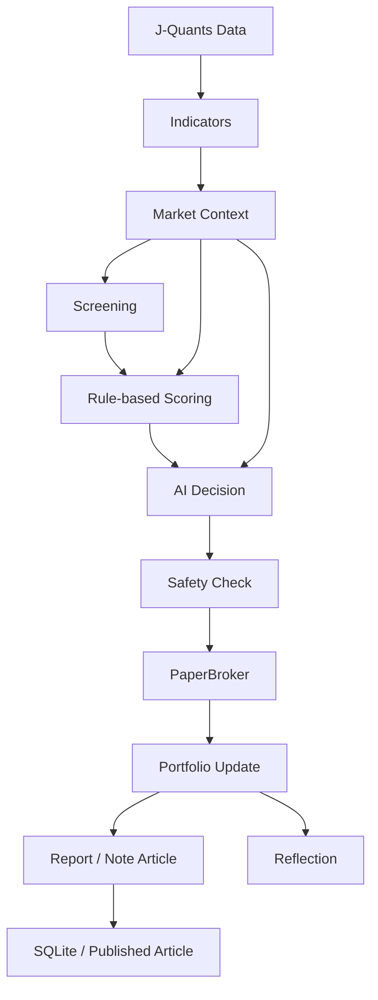

# 新人ディーラー1号の銘柄選定・売買判断フロー

このドキュメントは、新人ディーラー1号がどのように銘柄を選び、どの情報を確認し、どの条件で売買し、どこに記録するかを説明します。

AI Fund Labは研究・実験用途のプロジェクトです。現時点では実売買は未実装で、注文は `PaperBroker` による仮想売買として扱います。ここに書かれている判断材料は投資助言ではありません。

## 全体フロー図

## 処理順

1. データ取得

`src/data_provider.py` がデータ取得を担当します。正式な株価データ源はJ-Quantsです。対象は東証プライム銘柄を基本とし、J-Quants Freeプランでは12週間遅延データである可能性を前提に検証します。`demo` モードでは外部APIを使わず、ダミーデータで同じ処理の流れを確認します。

2. 指標計算

`src/technical_indicators.py` と `src/candlestick.py` が、日足データからテクニカル指標を作ります。移動平均線、RSI、MACD、ボリンジャーバンド、ATRは `pandas-ta` を使い、ローソク足特徴量とローソク足シグナルは自前計算です。

保存される主な指標は、`ma5`、`ma25`、`rsi`、`volume_ratio`、`turnover_value`、`five_day_volatility`、`candle_type`、`candlestick_signals`、`macd_hist`、`bb_position`、`atr` です。

3. market_context生成

`src/market_context.py` が市場全体と業種別の状態を作ります。東証プライム全体の値上がり銘柄比率、平均騰落率、売買代金合計から `market_regime` を判定し、業種ごとに値上がり銘柄比率、平均騰落率、売買代金合計、出来高増加銘柄数、`sector_momentum_score` を計算します。

取得できないデータがある場合は、処理全体を止めずに中立扱いにします。これは、外部APIや一部データ欠損で運用全体が不必要に落ちないようにするためです。

4. 一次スクリーニング

`src/screening.py` と実データ用の `src/real_screening.py` が候補銘柄を絞り込みます。流動性、出来高増加、移動平均線の位置関係、RSI、直近値動きの荒さを見て、買付候補になりうる銘柄を抽出します。

条件を満たす銘柄が少ない場合は `fallback screening` を行います。fallback採用銘柄には `fallback: true` を付け、通常条件を満たした銘柄とは区別できるようにします。

5. ルールベーススコアリング

`src/scoring.py` が候補銘柄を100点満点で評価します。大枠はテクニカル50点、ニュース30点、財務20点です。テクニカル50点は、`trend_score`、`volume_score`、`rsi_score`、`candlestick_score` に分けて計算します。

ローソク足では、陽線、強い陽線、長い上ヒゲ、長い下ヒゲ、5日線回復、`close > ma5 > ma25` の上昇配列、出来高を伴うブレイク、過熱警戒などを見ます。業種が強い場合は加点し、弱い場合は減点します。ただし業種補正は最大±5点です。

6. AI Decision

`src/ai_decision.py` は、ルールベース採点後の候補を最終確認します。`ai_decision.enabled: true` の場合、候補銘柄をまとめてOpenAIへ渡します。銘柄ごとの個別API呼び出しはしません。

AIへ渡す情報には、候補銘柄のスコア、選定状態、ローソク足シグナル、業種モメンタム、`market_context`、ポートフォリオ状況が含まれます。AIは最終選定、見送り理由、リスク評価、コメントを返します。APIキー未設定、API失敗、`daily_call_limit` 超過時はルールベースへフォールバックします。

7. 売買実行前のSafety Check

`src/safety.py` が注文前の安全確認を担当します。実売買モードではないこと、`STOP_TRADING` が存在しないこと、1注文あたりの上限、1日の買付上限、損失率、ドローダウンなどを確認します。

買付だけでなく、翌営業日寄り付きで約定する pending order の実行直前にも safety を再確認します。これにより、注文作成後に安全設定や停止フラグが変わった場合でも、実行直前に止められます。

8. Broker

`src/broker.py` が注文の受け口です。現時点で使うのは `PaperBroker` だけです。`PaperBroker` は仮想的に約定ログを返すだけで、証券会社APIへ注文を出しません。

`TachibanaDemoBrokerStub`、`TachibanaLiveBrokerStub`、`KabuStationBrokerStub` は準備中または将来候補です。呼び出されても例外を出す設計で、現時点では実注文は送信しません。

9. Portfolio Update

`src/paper_trade.py` と `src/portfolio.py` が、現金、保有銘柄、評価額、損益、保有日数、pending order を更新します。買付は最大5銘柄、1銘柄20%、100株単位、損切り-3%、利確+6%、最大保有5営業日を基本にします。

売却条件に到達した場合は、利確、損切り、最大保有期間のいずれかを `exit_reason` として保存します。

10. Report / Note Article / Reflection

`src/report.py` は日報やバックテストレポートを作ります。`src/article.py` はnote記事用Markdownを作ります。`src/reflection.py` は売却後の振り返りを作ります。日報とnote記事には、選定銘柄、ローソク足タイプ、移動平均線の状態、出来高確認、注意シグナル、今日強かった業種を表示します。

note記事は自動投稿しません。`articles/drafts/<profile_id>/` に下書きを作り、人間が確認して公開する運用です。

11. 保存

`src/db.py` がSQLite保存を担当します。主な保存先は、`screening_results`、`scoring_results`、`ai_decisions`、`trades`、`portfolio_snapshots`、`reflections`、`articles`、`market_contexts` です。

DB、ログ、レポート、記事には `profile_id`、`profile_name`、`config_version` を保存します。これにより、どのAIファンド人格が、どの設定バージョンで、どの判断をしたかを後から追跡できます。

## 各モジュールの役割

`src/main.py` はCLIの入口です。`--mode` に応じて、preflight、demo、run-daily、backtest、analyzeなどを呼び分けます。`--profile` を受け取り、profile別の設定と出力先を使います。

`src/profile_loader.py` はprofile設定の読み込みを担当します。`config/rookie_dealer.yaml` を互換用のベース設定として読み、`config/profiles/<profile_id>.yaml` を重ねます。2号機以降はprofile YAMLを追加するだけで作れる構成です。

`src/config_version.py` は設定のバージョン識別を担当します。実行時の設定から `config_version` を作り、DBやログに保存します。売買結果を後から比較するとき、どの設定で出た結果かを区別できます。

`src/screening.py` は、ダミーデータや候補リストに対する一次選別を担当します。実データに近い処理は `src/real_screening.py` が担当します。

`src/scoring.py` は、候補銘柄のスコアリングを担当します。テクニカル、ニュース、財務、信頼度、業種補正、市場環境補正をまとめ、`selected` と `rejected_reason` を決めます。

`src/market_context.py` は、市場全体と業種別モメンタムを担当します。候補銘柄が強い業種に属しているか、地合いがリスクオンかリスクオフかを補助情報として提供します。

`src/ai_decision.py` は、OpenAIを使う最終判断とルールベースfallbackを担当します。コスト管理のため `daily_call_limit` を持ち、取得できる場合は `token_usage` と `estimated_cost` を保存します。

`src/safety.py` は、注文前の安全確認を担当します。実売買のロック、金額上限、損失・ドローダウン停止、`STOP_TRADING` を確認します。

`src/broker.py` は、Broker抽象とスタブを担当します。現時点では `PaperBroker` のみが実際に使われ、TachibanaとKabuStationは未実装スタブです。

`src/article.py` と `src/report.py` は、運用結果を人間が読めるMarkdownに変換します。記事生成は記録と説明のためで、自動投稿や投資勧誘のためではありません。

## 買わない判断

新人ディーラー1号は、次の条件では買いません。

- `total_score` がprofileの基準未満
- `confidence` が低い
- 地合いが悪く、市場環境補正で慎重判定になっている
- 100株単位で買えない
- 1銘柄あたりの上限金額を超える
- 既に最大保有銘柄数に達している
- `safety.py` に拒否された
- `storage/STOP_TRADING` が存在する
- AI Decisionが見送りと判断した

買わなかった理由もログに残します。AI Fund Labでは「なぜ買ったか」だけでなく「なぜ買わなかったか」も検証対象です。

## profile設定との関係

profileは、AIファンド人格ごとの性格、売買ルール、リスク許容度、機能ON/OFFを持ちます。たとえば `rookie_dealer_01` は教科書通りでルール重視の新人ディーラーとして動きます。

profileで切り替えられる主な項目は、初期資金、最大保有数、1銘柄比率、損切り、利確、最大保有日数、AI DecisionのON/OFF、ニュースのON/OFF、market_contextのON/OFF、sector_analysisのON/OFF、安全上限です。

システム本体、DB、データ取得、スコアリング処理は共通です。AIファンド2号、3号を作る場合は、新しいprofile YAMLを追加します。秘密情報はprofileに含めず、`.env` で別管理します。

## config_versionとの関係

`config_version` は、profileと設定内容に紐づく識別子です。運用成績を見るとき、同じ新人ディーラー1号でも、損切り幅、利確幅、スコア基準、AI Decision設定が変われば、結果の意味も変わります。

そのため、AI Fund Labでは `profile_id` と `config_version` を一緒に保存します。`analyze` ではprofile別、config_version別に集計できるようにし、設定変更前後の比較を可能にします。

## 未実装・準備中の範囲

実売買は未実装です。TachibanaとKabuStationのBrokerはスタブで、現時点では注文を外部APIへ送信しません。

ニュースはGoogle News RSSを使った簡易判定です。ニュース本文、TDnet、適時開示、決算短信の詳細解析は今後の拡張候補です。

財務スコアは準備中の項目を含みます。J-Quantsの財務データ取得や詳細ファンダメンタル分析は今後強化する予定です。

OpenAI AI Decisionは任意機能です。APIキー未設定でも、ルールベースfallbackで動く設計です。
